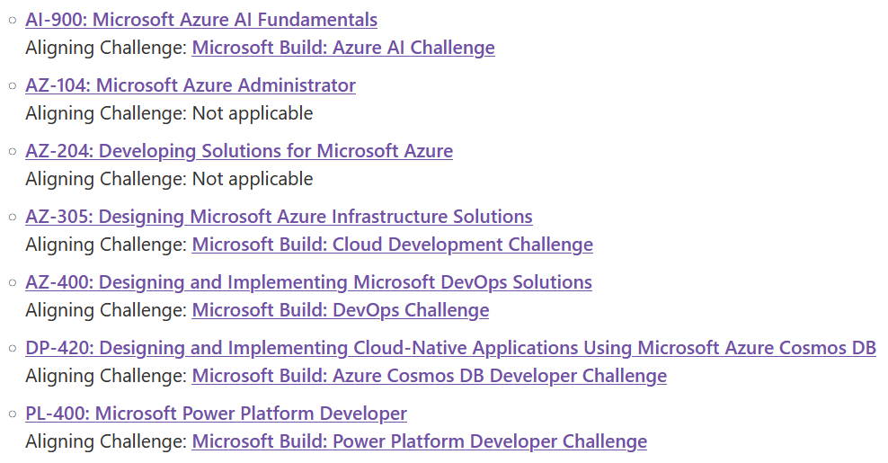

This week is an interesting one for people working in a team with people in the United States, where the 4th of July is a public holiday, and many people take some additional days off. Which provides opportunity for others who are at work to focus and get things done.

For me that means resetting important items to focus on, according to https://gettingresults.com/30-days-of-getting-results-free-ebook/

Thanks for reading! :-)
