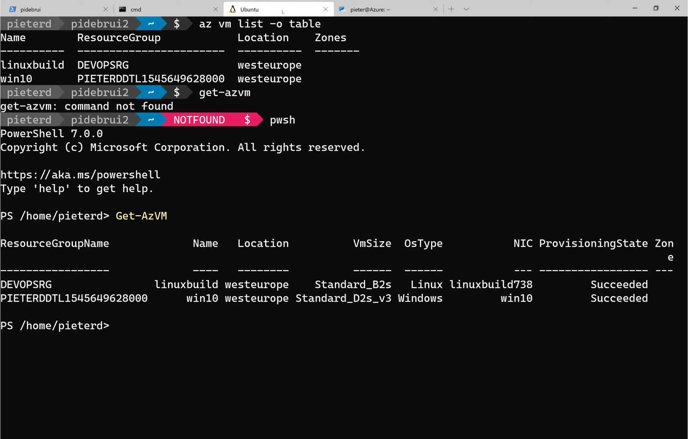

In this video I use Windows Terminal to access Azure using powershell, command prompt, ubuntu bash through windows subsystem for linux and azure cloud shell. 

Check out [the video](https://www.youtube.com/watch?v=qBS_Knxaz5A)