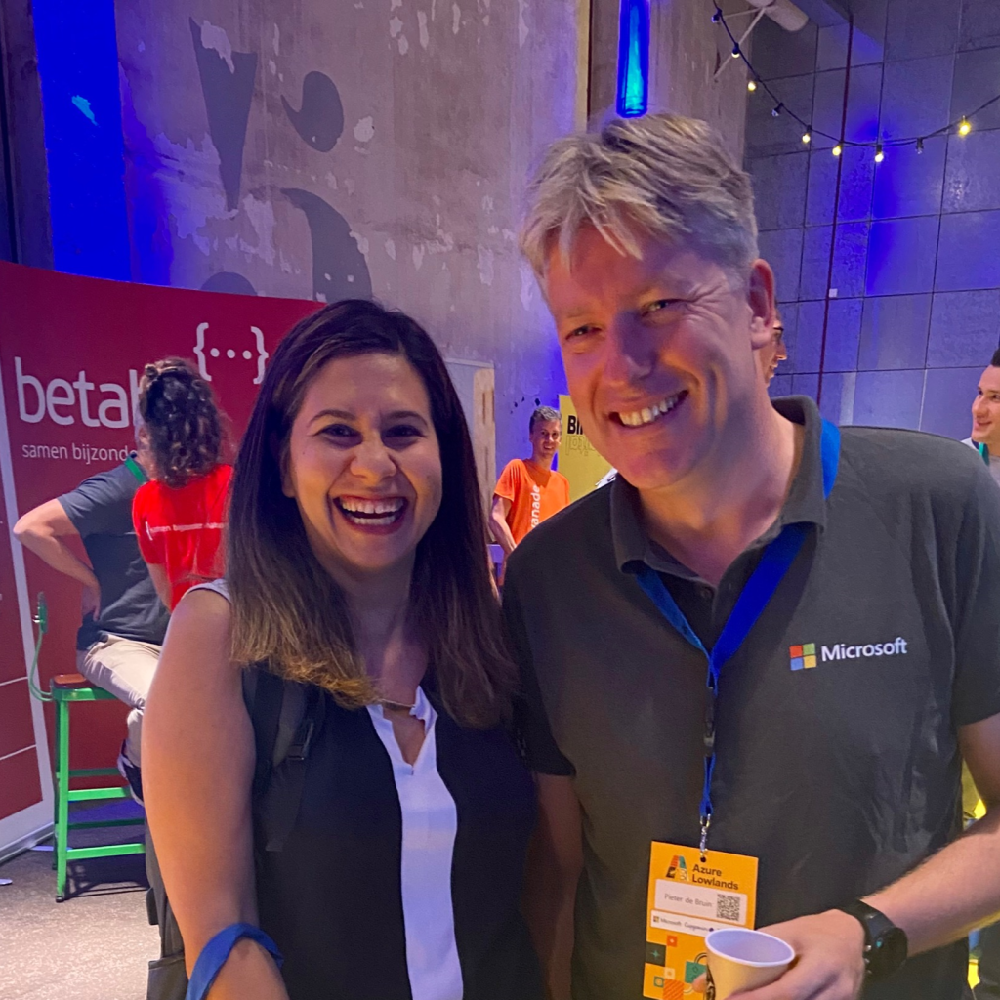

On June 30 [Sherry List](https://twitter.com/sherrrylst) and I met in-person for the first time to present at Azure Lowlands in Utrecht Netherlands. This was a great experience because we could meet old and new friends from the community and we could talk about contributing and sharing information. Also it was great to meet colleagues and the event was very well organized.

The story line was about how you can grow from enthusiast to authority by sharing information. And to make it concrete we used the example of [Rod Trent](https://twitter.com/rodtrent)'s [Must Learn KQL](https://github.com/rod-trent/MustLearnKQL)

[Presentation](https://github.com/pdebruin/presentations/blob/main/AzureLowlands2022/Must%20learn%20KQL%2020220630.pdf)

youtube my story.
