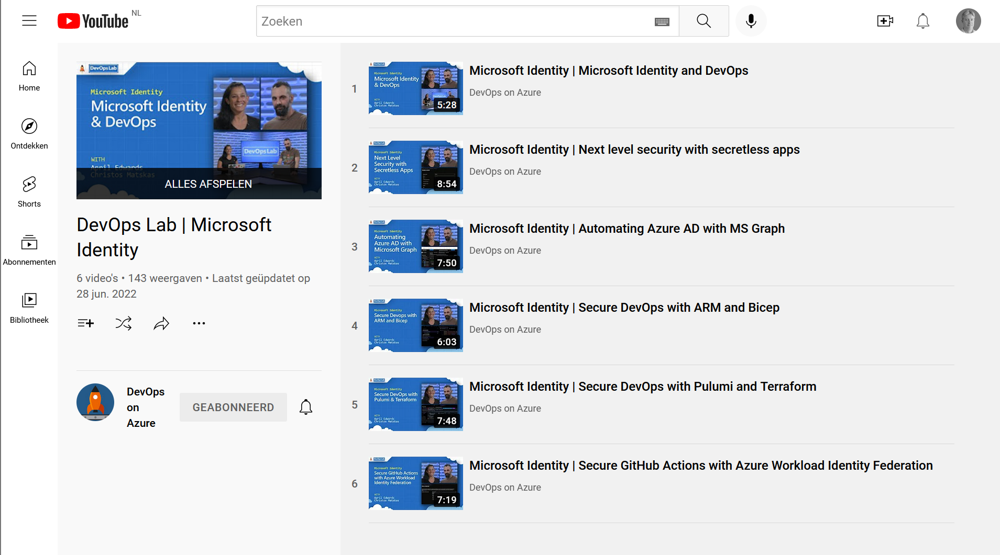
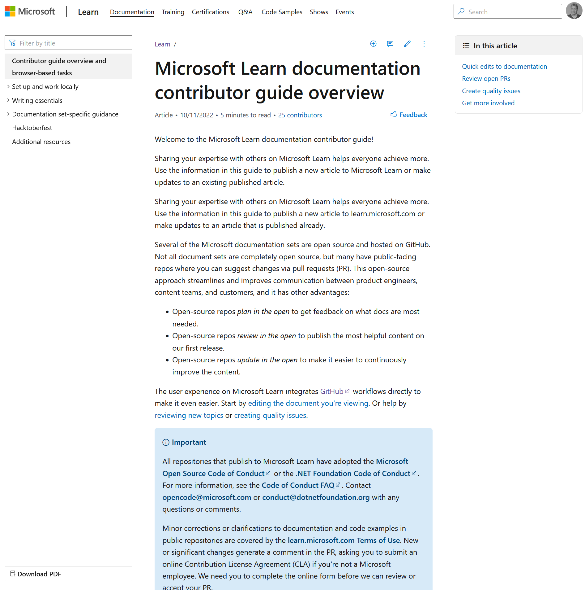

On June 30 [Sherry List](https://twitter.com/sherrrylst) and I presented at Azure Lowlands in Utrecht Netherlands. This was a great experience for many of reasons.

It was my first large in-person event after the start of covid, where we met old and new friends from the community. It was refreshing to run in to a lot of people, connect, catch up, brainstorm, and so on. Logistically it could not be more convenient at just a bike ride away technically, if the weather had been more bike-friendly. A shoot out has to go to the organization including [Henk Boelman](https://twitter.com/hboelman) who had done a great job with food and music at the event. Whenever opportunities like these arise, I will make an effort to join again.

Most exciting for Sherry and me was that we could talk about the work we do: Help technical experts share their experience.

We explained how you can grow from enthusiast to authority by sharing information. To make it concrete we started by introducing [Rod Trent](https://twitter.com/rodtrent)'s work on [Must Learn KQL](https://github.com/rod-trent/MustLearnKQL). Some time ago he noticed that people were interested in new monitoring and security services in Azure, but were hesitant to start using them because it required them to learn the new Kusto query language. So he started to create content to explain KQL step-by-step, first in blog posts on GitHub, then bundled in an e-book, next he created videos on YouTube, an assessment with certification, a web shop, and the list goes on. All proceeds go to [a children's hospital](https://www.stjude.org/). As you can see you can actually become a thought leader; just be proactive, share your opinion, and grow through the community.

[Presentation](https://github.com/pdebruin/presentations/blob/main/AzureLowlands2022/Must%20learn%20KQL%2020220630.pdf)

