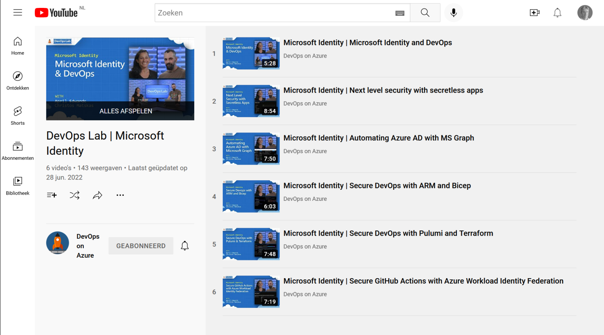

In [this post](./share-your-knowledge/) I described a recent conference presentation about sharing knowledge and becoming a thought leader. There are lots of ways to share like social media, your own blog, and youtube. Did you know you can also share on Microsoft Learn? 

Q&A https://learn.microsoft.com/answers/products/?wt.mc_id=pdebruin_content_blog_cnl_csasci
TechCommunities https://techcommunity.microsoft.com/?wt.mc_id=pdebruin_content_blog_cnl_csasci

Documentation https://learn.microsoft.com/docs/?wt.mc_id=pdebruin_content_blog_cnl_csasci
Training https://learn.microsoft.com/training/?wt.mc_id=pdebruin_content_blog_cnl_csasci
Architecture center https://learn.microsoft.com/azure/architecture/?wt.mc_id=pdebruin_content_blog_cnl_csasci

https://learn.microsoft.com/en-us/contribute/?wt.mc_id=pdebruin_content_blog_cnl_csasci