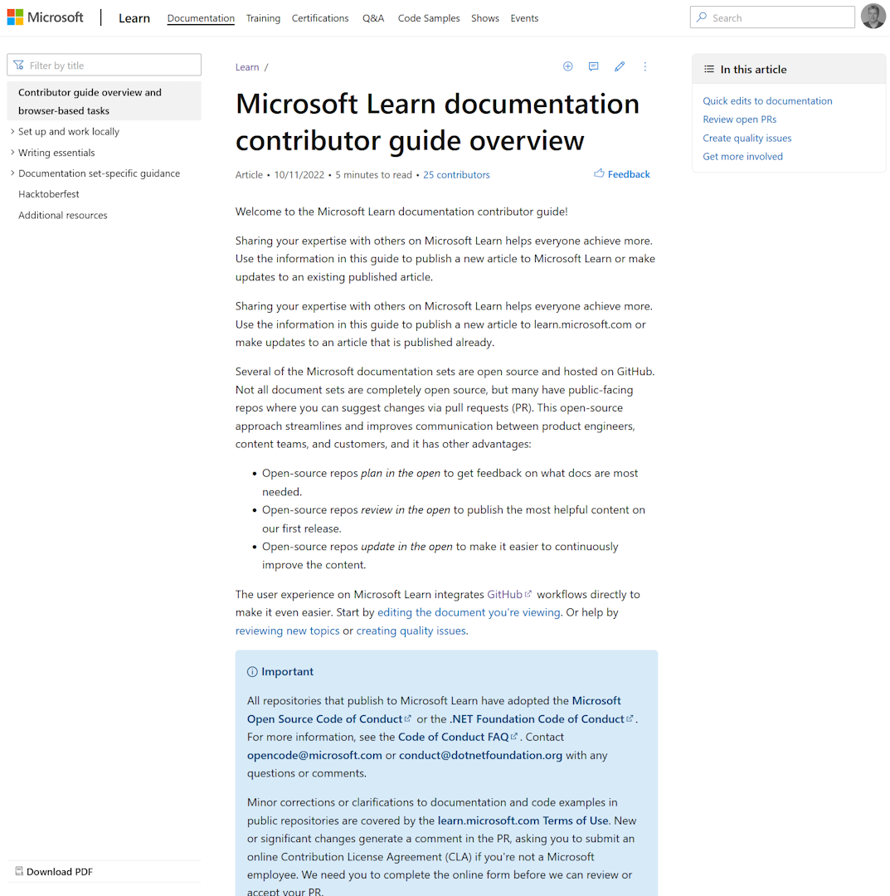

In [this post](../share-your-knowledge/) I described a recent conference presentation about sharing knowledge and becoming a thought leader. There are lots of ways to share like social media, your own blog, and youtube. Did you know you can also share on [Microsoft Learn](https://learn.microsoft.com/answers/products/?wt.mc_id=pdebruin_content_blog_cnl_csasci)?

Thanks for reading! :-)
