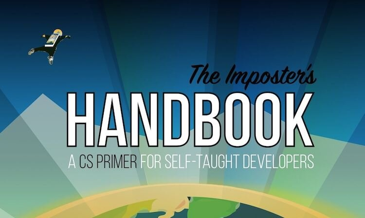

I love to learn all the things in information technology. And I think sharing those learnings are a great way to learn them even better: To explain things, you really have to go step-by-step to make sure your audience can follow.

For over two decades I have been working in IT, so you could say I am pretty technical. On the other hand, I studied economics, have been in presales, consulting and program management roles, so you could also say I am not that technical. This is where imposter syndrome comes in: one of the main reasons we don't share as much as we do, is because we feel this.

*"Impostor syndrome [...] is a psychological occurrence in which an individual doubts their skills, talents, or accomplishments and has a persistent internalized fear of being exposed as a fraud.*
Source: [Wikipedia](https://en.wikipedia.org/wiki/Impostor_syndrome)

Cover from [the imposter's handbook](https://bigmachine.io/products/the-imposters-handbook/)

Scott Hanselman's blog post [I'm a phony. Are you?](https://www.hanselman.com/blog/im-a-phony-are-you)

At some point you will realize there are always going to be people more technical than you. You don't have to know it all. You can always learn more (like the book above), and you can always ask others. To put it differently: If you are going to only start sharing once you are at the top of the knowledge pyramid, lots of time and expertise is going to get wasted in the meantime. This is especially true for fast changing environments like cloud computing.

For the past years I have posted directly on LinkedIn and Twitter. I want to change that a bit. Blogging is likely part of it, since that is what I did when I was Microsoft MVP in 2009-2011. Given that is over a decade ago, the world of sharing has changed so I should also consider other social and video options: [YouTube](https://www.youtube.com/@pdebruin) [TikTok](https://www.tiktok.com/@pieter_de_bruin) Scary! And Exciting! :-)