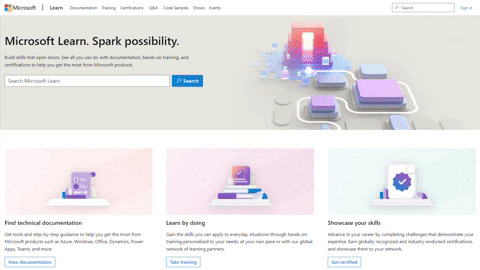

Microsoft Learn is the new home for all technical content, learning tools and resources. Documentation is still [here](https://learn.microsoft.com/azure/?wt.mc_id=pdebruin_content_blog_cnl_csasci). Learn modules and paths are now called [training](https://learn.microsoft.com/training/browse/?resource_type=learning%20path&expanded=azure&products=azure&wt.mc_id=pdebruin_content_blog_cnl_csasci). And architecture center is [here](https://learn.microsoft.com/azure/architecture/?wt.mc_id=pdebruin_content_blog_cnl_csasci). Old links and bookmarks should work and redirect appropriately. 

[Build skills that open doors](https://techcommunity.microsoft.com/t5/microsoft-learn-blog/build-skills-that-open-doors-with-microsoft-learn/ba-p/3614011?wt.mc_id=pdebruin_content_blog_cnl_csasci)
