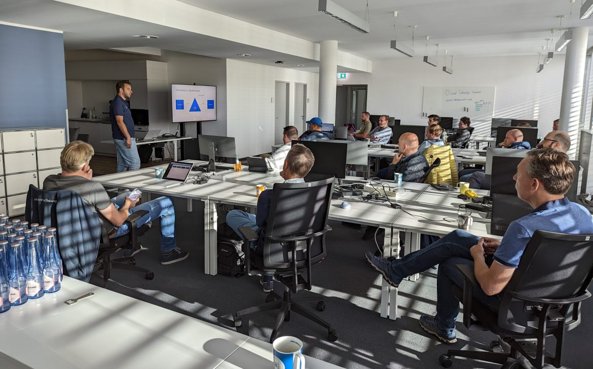

On September 22 I attended Cloud Identity Summit in Bonn, Germany. [Stefan van der Wiele](https://twitter.com/wiele) informed me of the event, where he was going to run a workshop on Azure AD verifiable credentials.

The promising program delivered: the parallel workshops were very well received. And the presentations were done by people who really know their field. Actually the audience was also very impressive. This is part of the reason why I was there: to connect with customer-facing technical experts to potentially work with to build on each other's content.

The venue was close to the Rhine river which helps to get sunlight, fresh air and some steps.

All in all: highly recommended for next year.

https://www.identitysummit.cloud/

Recap by one of the organizers with more details and photos of the event
https://reimling.azurewebsites.net/2022/09/cloud-identity-summit-2022-recap/

Thanks for reading! :-)
