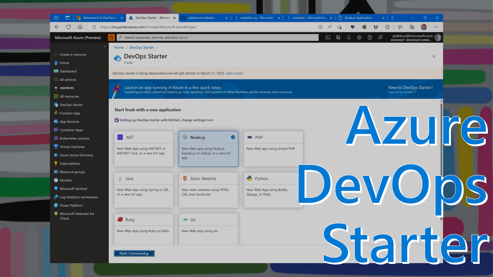
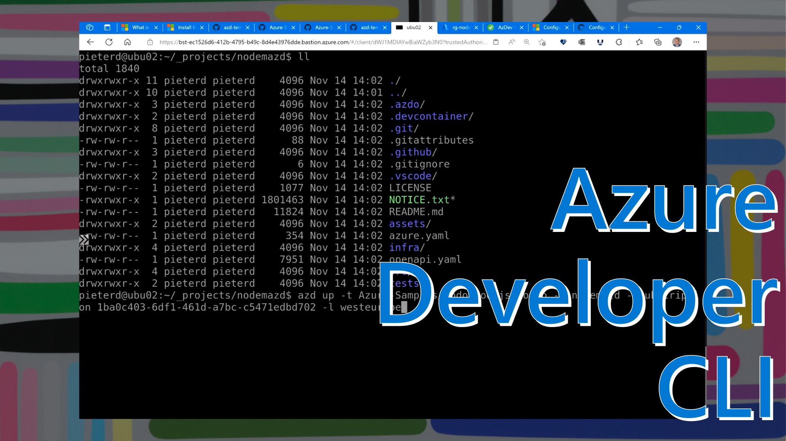

DevOps Starter is a service that can help you get started with Azure very quickly: with just a few clicks you can select a programming language, and a compute service and DevOps Starter will set it in Azure DevOps or GitHub: A sample app in version control, with automated build and deployment to Azure. And after a couple of minutes your Java sample can be running on AKS, Node on AppService, etc. Very useful for demonstration purposes, or learning about CI/CD or a new service.



[Watch the 13-minute walkthrough video](https://www.youtube.com/watch?v=DstLJLHjSog)

The sad news is that Azure DevOps Starter is being retired on March 31 2023. The good news is there is a new option to achieve comparable results: Azure Developer CLI (azd). Azd is a command-line tool which means it is easier to use in automation. And azd uses templates that anyone can build.



[Watch the 14-minute walkthrough video](https://www.youtube.com/watch?v=O_h8Fhrf0Pc)

There are a few differences in the experience:

* Make sure to check the prerequisites including git, github cli and az cli. Additionally depending on the template you use, there may be more prerequisites like node for the template used in the video.
* This is a two-step approach. First ```azd up``` downloads the template locally and then deploys Azure resources. Then ```azd deploy config``` adds the local files to GitHub or Azure DevOps version control and creates the CI/CD pipeline in GitHub Actions or Azure Pipelines.
* The first time I ran azd, I was using a Linux virtual machine in Azure accessed through Bastion over https. This approach doesn't allow pop-up windows like you could have in a local shell. When running into challenges, make your setup as simple as possible.

[Azure Developer CLI](https://learn.microsoft.com/azure/developer/azure-developer-cli/overview?wt.mc_id=pdebruin_content_blog_cnl_csasci)

[Azd on GitHub](https://github.com/Azure/azure-dev)

[Azd templates](https://github.com/topics/azd-templates)

Watch the azd episode on [Azure Friday](https://learn.microsoft.com/shows/azure-friday/introducing-the-azure-developer-cli-azd?wt.mc_id=pdebruin_content_blog_cnl_csasci)

Thanks for reading! :-)
