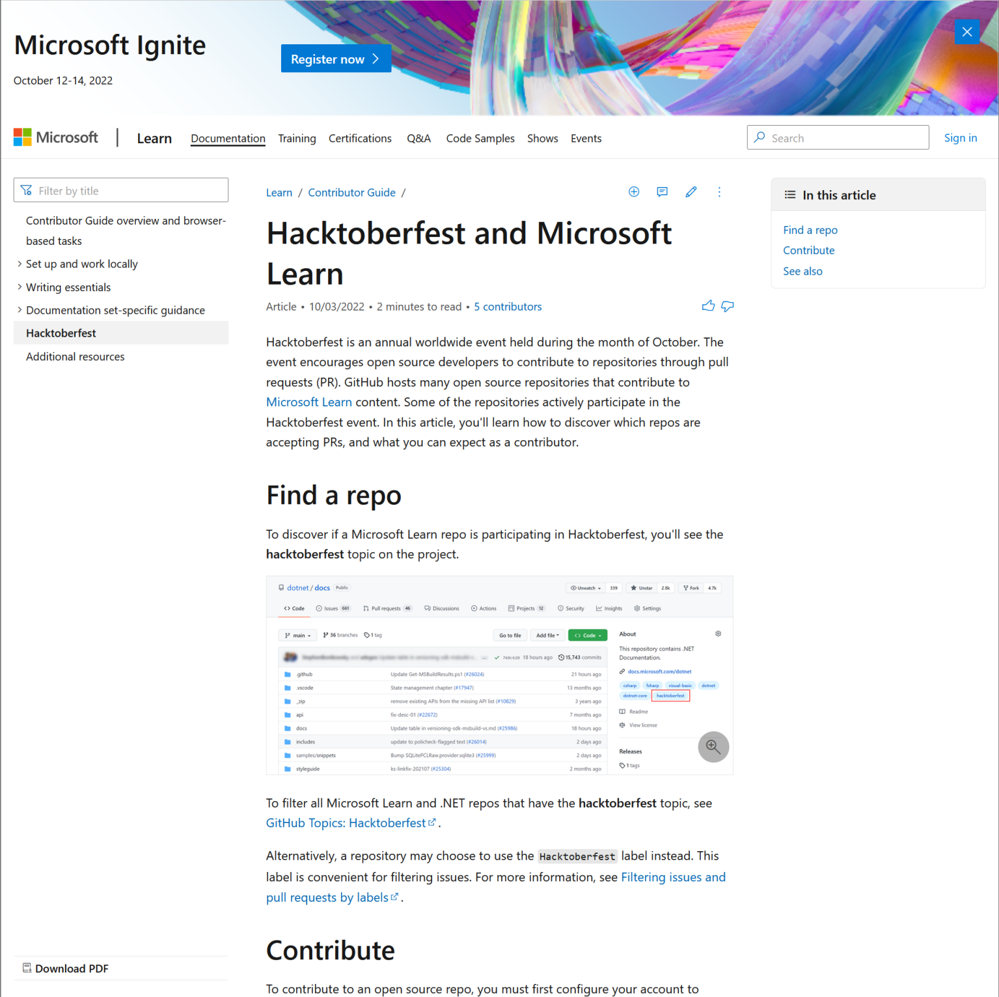

Hacktoberfest is an annual worldwide event held during the month of October. The event encourages open source developers to contribute to repositories through pull requests (PR). GitHub hosts many open source repositories that contribute to Microsoft Learn content. Some of the repositories actively participate in the Hacktoberfest event, and others are open for contributions as usual.

Read more in the [Microsoft Learn contributor guide](https://learn.microsoft.com/contribute/hacktoberfest?wt.mc_id=pdebruin_content_blog_cnl_csasci)

