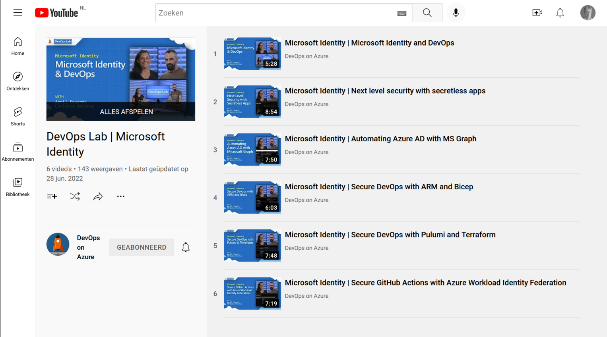

This week was about Ignite. Build, which happened earlier in the year, and Ignite are big Microsoft events where many product announcements are made. 

Did you hear about Defender for DevOps? And GitHub Advanced Security in Azure DevOps? See [this blog post](https://devblogs.microsoft.com/devops/integrate-security-into-your-developer-workflow-with-github-advanced-security-for-azure-devops/?wt.mc_id=pdebruin_content_blog_cnl_csasci)

Security sessions.

Read all announcements in the [book of news](https://news.microsoft.com/ignite-2022-book-of-news/?wt.mc_id=pdebruin_content_blog_cnl_csasci)

Thanks for reading! :-)
