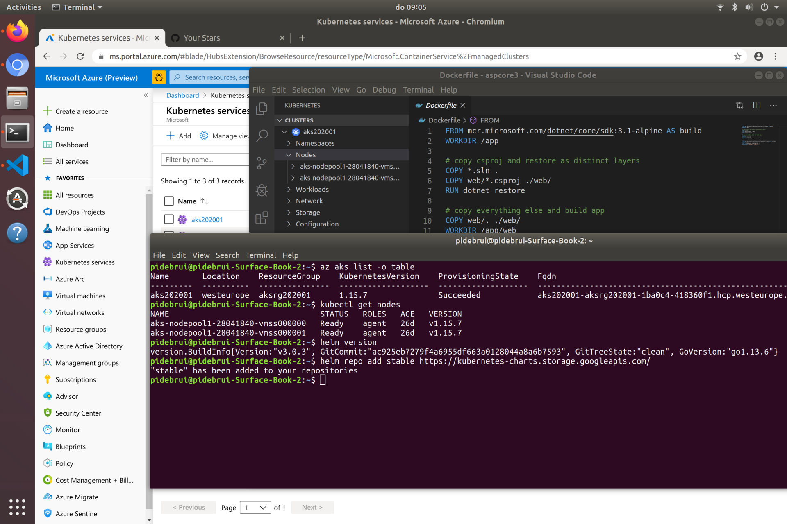

A couple of years ago Azure had the tagline: Cloud for all. I loved that because it made clear that you can run your solution on Azure, regardless of the operating systems, data stores, or programming languages it uses.

Ubuntu, Suse, Redhat, etc

Did you know about Mariner Linux? 
And that Windows Subsystem for Linux brings Linux inside Windows without virtual machines?

PostgreSQL, MariaDB, MySQL,  Cassandra, Mongo, Redis, etc

Python, JavaScript, Java, Go ...

You can access Azure services through REST APIs, the Azure Portal, command-line interface, powershell, terraform, pulumi

Did you know Powershell and DotNet work cross-platform?

GitHub acquisition

Contributing to oss
aks
https://github.com/microsoft/CBL-Mariner

opensource.microsoft.com
Many projects are open including Code, Kubernetes Event-driven Autoscaling, TypeScript, 

FOSS https://cloudblogs.microsoft.com/opensource/2022/10/24/making-culture-count-for-open-source-sustainability-celebrating-foss-fund-25/?wt.mc_id=pdebruin_content_blog_cnl_csasci)

