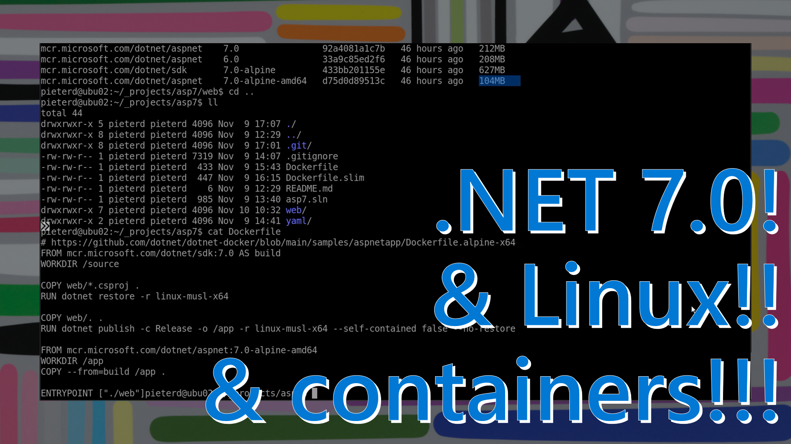

Did you know DotNet runs on Linux, MacOS and Windows? It also runs in containers. .NET 6.0 is the long-term support (3 years) version released last year. .NET 7.0 is the latest version with standard support (1 1/2 years).

[Watch the 10-minute walkthrough video](https://www.youtube.com/watch?v=mSi8nvwObXc)

The [dotnet command-line interface](https://learn.microsoft.com/en-us/dotnet/core/tools/?wt.mc_id=pdebruin_content_blog_cnl_csasci) helps create new apps, or restore packages, or build and publish your app. ''' dotnet new list ''' returns all the templates you can use to start a new .net project, for instance asp.net mvc, asp.net with react, blazor server, blazor webassembly, etc. 

The default container image for .NET is larger than necessary. Use the [.net alpine x64 image](https://github.com/dotnet/dotnet-docker/tree/main/samples/aspnetapp) to reduce the container image by half, and speed pulling, building and pushing operations. 

Once containerized, the .net app can run on any [container hosting option](https://azure.microsoft.com/en-us/products/category/containers/?wt.mc_id=pdebruin_content_blog_cnl_csasci) including Azure Kubernetes Service, Azure Container Apps, or Azure App Service. Each of these services are worth a separate post. To be continued.

[ASP.NET sample using Alpine container image](https://github.com/pdebruin/asp7)

[Learn .NET](https://dotnet.microsoft.com/learn?wt.mc_id=pdebruin_content_blog_cnl_csasci).

[DotNetConf videos](https://www.youtube.com/c/dotNET/videos)

Thanks for reading! :-)
