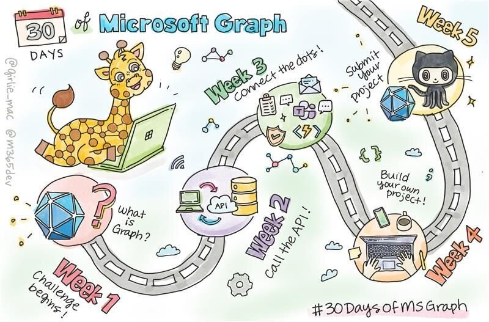

Everyday millions of people spend their precious time on productivity tools. What if you use data and intelligence behind the Microsoft applications (Microsoft Teams, Outlook, and many other Office apps) to build automations and apps to boost productivity?

Read more in the [introduction post](https://devblogs.microsoft.com/microsoft365dev/announcement-30-days-of-microsoft-graph-challenge?wt.mc_id=pdebruin_content_blog_cnl_csasci) and the [program roadmap](https://microsoft.github.io/30daysof/docs/roadmaps/microsoft-graph?wt.mc_id=pdebruin_content_blog_cnl_csasci).
