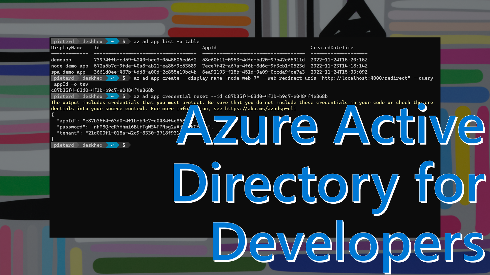
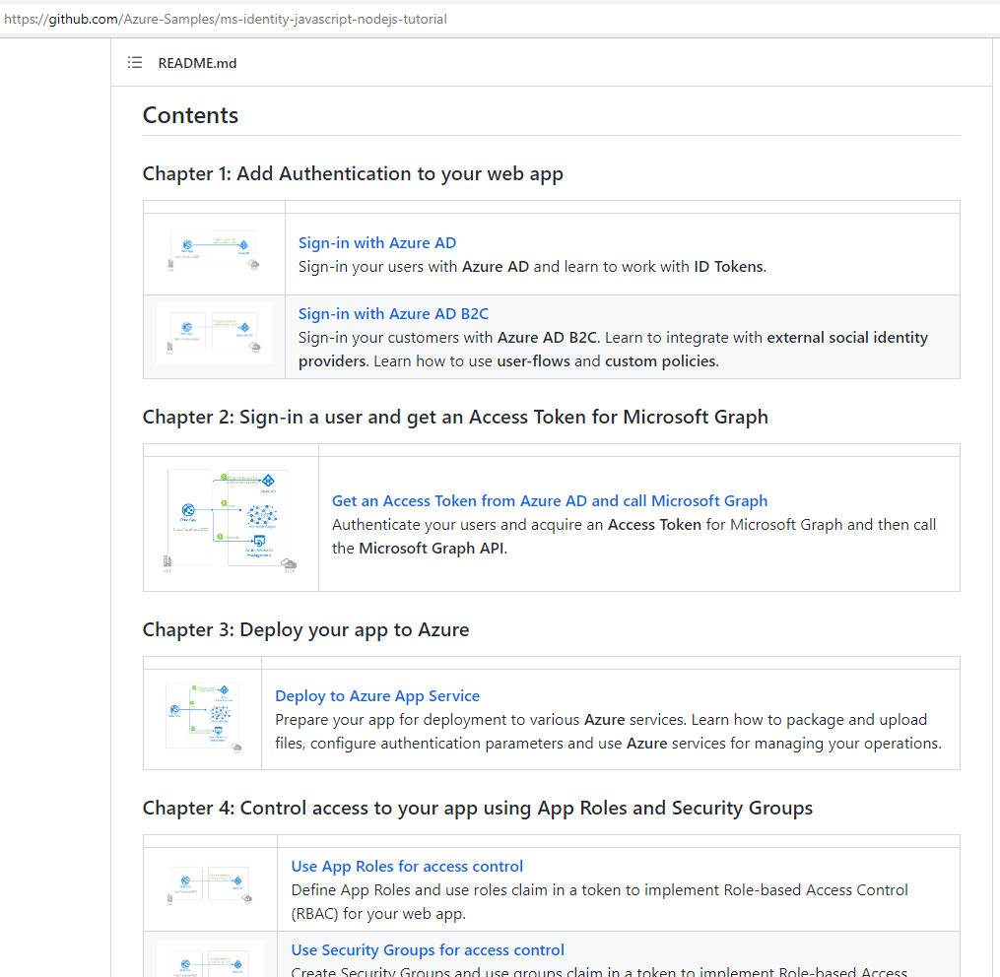
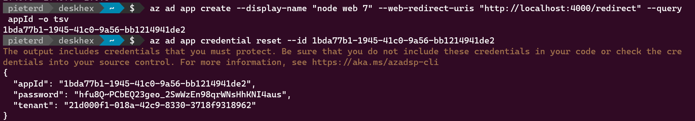

Azure Active Directory helps developers authenticate users in any app and any language. There are a few concepts you should know about.

Before you start developing with Azure Active Directory (AzureAD) it helps if you have global administrator access to an AzureAD instance. For instance, you may have access to a stand-alone Azure subscription through a trial or a [Visual Studio benefit](https://my.visualstudio.com/?wt.mc_id=pdebruin_content_blog_cnl_csasci). Another way is to join the [Microsoft 365 developer program](https://developer.microsoft.com/microsoft-365/dev-program?wt.mc_id=pdebruin_content_blog_cnl_csasci).



[Watch the 11-minute walkthrough video](https://youtu.be/9rdHB-ewqLE)

The most important thing to know about is application registrations. This is a way to let AzureAD know about the type of app, how it should authenticate, where it has access to, what should happen after authentication, etc. As you can see, [Authentication flows](https://learn.microsoft.com/azure/active-directory/develop/authentication-flows-app-scenarios?wt.mc_id=pdebruin_content_blog_cnl_csasci) can become rather complex, and configuration should happen carefully to prevent losing time on debugging misconfiguration. The key is to start simple, make it work, and expand from there.

The good news is that there are [many samples](https://learn.microsoft.com/azure/active-directory/develop/sample-v2-code?wt.mc_id=pdebruin_content_blog_cnl_csasci) that cover authentication flows. In this case you will work with a [sample Node web app](https://github.com/Azure-Samples/ms-identity-javascript-nodejs-tutorial/blob/main/1-Authentication/1-sign-in/README.md?wt.mc_id=pdebruin_content_blog_cnl_csasci). Let's first focus on getting the sample to work, which should be easier than updating your own app with identity code and configuration from the sample.



The sample requires an app registration, which is how you get the **client ID** or appID. It should be configured for authentication as web app with return url (http://localhost:4000/redirect when developing locally). The app registration is created in your instance of Azure Active Directory, which has a **tenant ID**. You also want to create a **client secret** or password.

```azurecli

az ad app create --display-name "node web" --web-redirect-uris "http://localhost:4000/redirect" --query appId -o tsv
az ad app credential reset --id <appId>

```



The second command returns appId, password and tenant id, which you all need to configure the sample. Open appSettings.js in the app folder and replace the defaults with your values. Now you can run ```npm install```, ```npm start``` and open "http://localhost:4000" in your browser.

If you are interested to see what the portal or the cli create, use ``` az ad app show --id <appId> ``` to inspect and compare the object in json. 

The last topic to discuss is the permissions request: After the first sign-in, Azure Active Directory prompts the user additionally for the permissions the application requests. In this case it wants to view your basic profile and maintain access to data you have given it access to. More [about consent](https://learn.microsoft.com/azure/active-directory/develop/application-consent-experience?wt.mc_id=pdebruin_content_blog_cnl_csasci)
