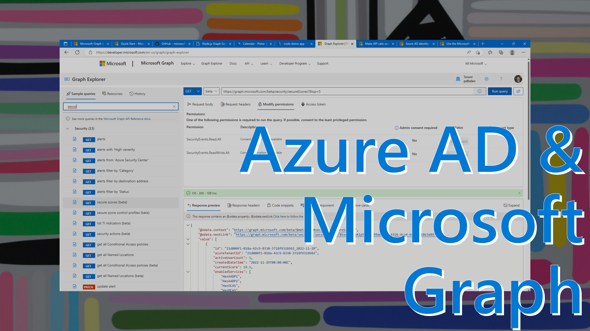
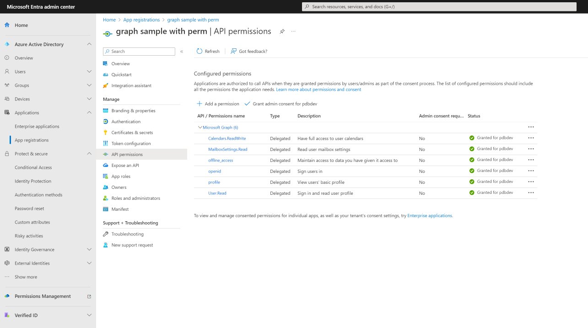
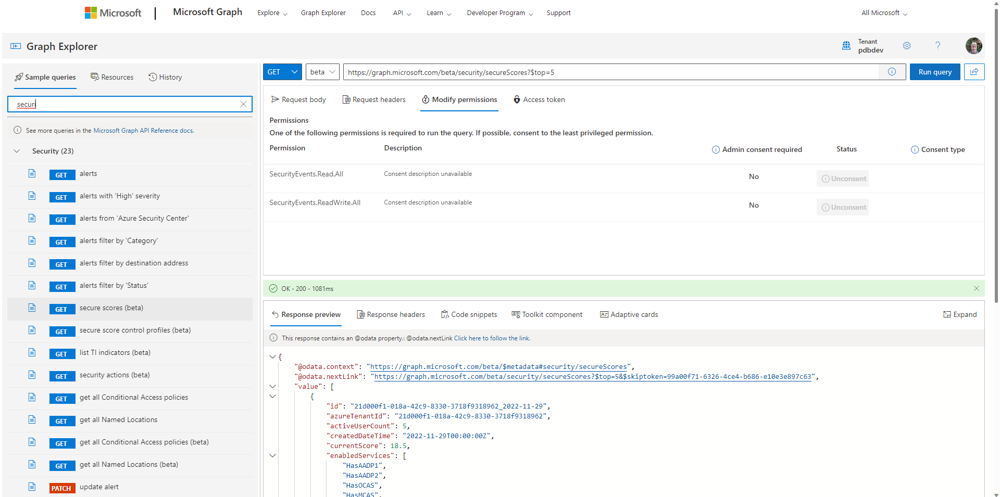

Microsoft Graph is the gateway to data in Microsoft 365, Dynamics 365, Windows, and Enterprise Mobility + Security. Using Microsoft Graph's APIs and the corresponding permissions, you can access traditional productivity data like emails and events, and security and identity information like groups, devices, app registrations, audit logs, high risk users, security alerts, etc.

Note: If you missed the previous post about [Azure Active Directory for Developers](https://blog.pdebruin.org/azure-active-directory-for-developers/), you may want to check that out first.

Getting started with Microsoft Graph is easy: With [Microsoft Graph quick start](https://developer.microsoft.com/graph/quick-start?wt.mc_id=pdebruin_content_blog_cnl_csasci) you can choose your language, including NodeJS or Java, create an app registration, and download the pre-configured sample. The console app demonstrates how to list emails and to send an email.

[Watch the 10-minute walkthrough video](https://youtu.be/LRZrFDTpOLs)

If you are planning to build a webapp, you may want to start with a sample that is closer to your goal. For that take a look at [the Graph tutorial in JavaScript](https://learn.microsoft.com/en-us/graph/tutorials?wt.mc_id=pdebruin_content_blog_cnl_csasci). The completed tutorial provides functionality to sign in and to view and create calendar events. The app looks like just another task list but it works with the Graph calendar api to create objects you can find in Outlook, which is magical if you ever had to create those objects manually in the past. To get the sample running you will need to create an app registration, configure it in the sample, install packages and run it locally as described in the AzureAD for devs post.

This app is going to access your calendar, so it needs more permissions than just sign in. In this case the permissions defined in OAUTH_SCOPES are requested to the user during sign in. Another way is to provide permissions in the app registration directly: select API Permissions, Add a permission, Microsoft Graph, Delegated permissions, and there you can configure those same permissions as defined in OAUTH_SCOPES plus the regular sign-in permissions for openid, profile and offline_access. Read more about [permissions and consent](https://learn.microsoft.com/azure/active-directory/develop/permissions-consent-overview?wt.mc_id=pdebruin_content_blog_cnl_csasci).

You can see the requiredResourceAccess in JSON using the command-line interface. And you can create an app registration with --required-resource-accesses and a JSON string or file. 

Beyond emails and calendar events there is a lot of additional information in Microsoft Graph. The best way to find out is using the [Graph Explorer](https://developer.microsoft.com/graph/graph-explorer), which provides sample queries to compliance, identity and access, and security, etc. It shows details of the requests, responses and required permissions for the REST APIs. The [Graph API Reference docs](https://learn.microsoft.com/graph/api/resources/security-api-overview?wt.mc_id=pdebruin_content_blog_cnl_csasci) contain more information.

Once you know what operation you need, the simpler way is to develop with the [Microsoft Graph SDKs](https://learn.microsoft.com/graph/sdks/sdks-overview?wt.mc_id=pdebruin_content_blog_cnl_csasci)

Thanks for reading! :-)
