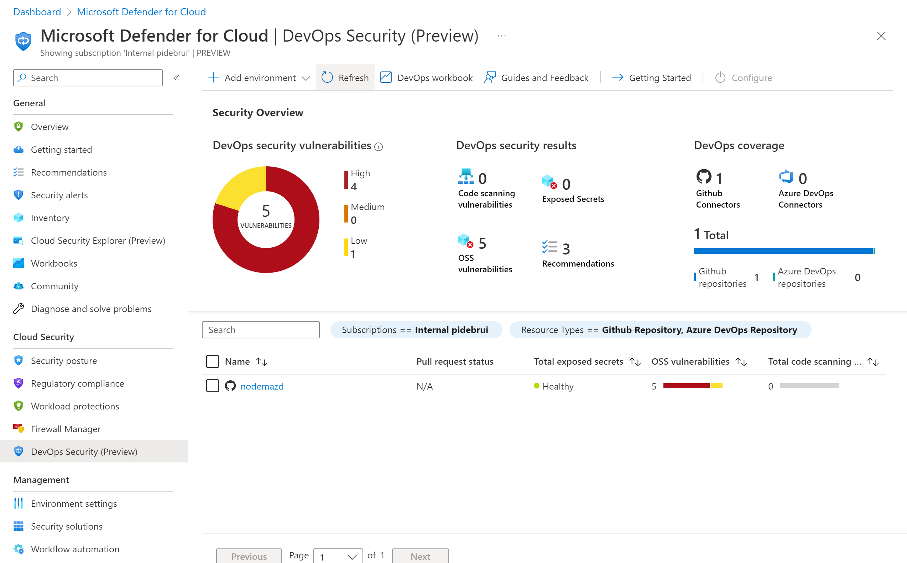

Earlier this year I studied [GitHub learning paths](https://blog.pdebruin.org/github-learning-paths/) to prepare for the GitHub advanced security exam. Recently there was a new reason to play with advanced security for the preview of [Defender for DevOps](https://learn.microsoft.com/azure/defender-for-cloud/release-notes#defender-for-devops-preview)

If you haven't worked with Defender for Cloud (DfC), previously Azure Security Center, it can assess your cloud services to report alerts and recommendations in one central location. For instance it can report suspicious file downloads and it can alert for operating system updates. The rename to DfC should also remind you that it can cover Azure, and Microsoft 365, and even services in other public clouds. There are also various specialized Defenders, like Defender for Servers, for Containers, for App Service, etc. And now there is [Defender for DevOps](https://learn.microsoft.com/azure/defender-for-cloud/defender-for-devops-introduction).

As you may know, GitHub Advanced Security provides code scanning, secret scanning, and dependency reviews, and reports these in the repository. In Defender for DevOps you can create a connection to your GitHub and/or Azure DevOps repositories, which brings repository level information to the central Defender for Cloud location. These are stored as hidden security connectors and github connectors in your Azure resource group. Defender for DevOps can also run workflows with additional scanning tools, including Template Analyzer, Terrascan, and Trivy.

Before doing this, please check that you are using a repository with GitHub Advanced Security enabled. Also note that currently the scanning action is only supported on a Windows runner. With these prereqs checked, it all worked fine.

If you want to know more about the action step microsoft/security-devops-action, check out [its repository](https://github.com/microsoft/security-devops-action). This may be useful when running into build errors and for debugging.

I also noticed the build log was over fifteen thousand (!) lines long. So remember you can view raw or download the logs and process in your favorite editor.

Thanks for reading! :-)
