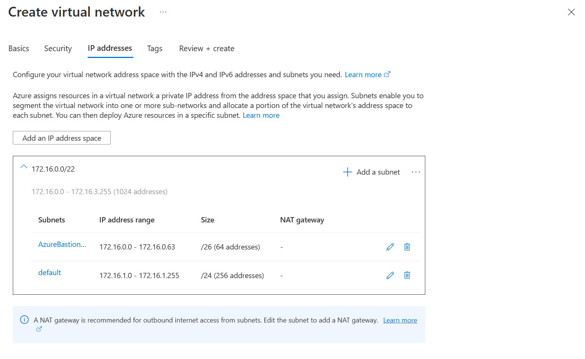

In previous episodes you may have witnessed me use a virtual machine in Azure. I always do that using [Azure Bastion](https://learn.microsoft.com/azure/bastion/bastion-overview?wt.mc_id=pdebruin_content_blog_cnl_csasci), which gives you secure access to Linux and Windows virtual machines using SSH or RDP over HTTPS, without exposing the VMs to the internet.


You can simply access your virtual machines by navigating to them in the Azure Portal, select connect, Bastion, enter credentials and you are in. Or you can use azcli!

This is the point where I would normally provide azcli commands to create the required Azure resources. while creating a virtual network in the Azure Portal, I noticed a couple of interesting things that convinced me to mention that approach too:

* On the Security tab, there is a checkbox to Enable Azure Bastion.
* And then on the IP addresses tab, there is guidance on what ranges to use for the virtual network and subnets. This really helps when planning address spaces is not your daily job :-)



Couldn't stop myself and wanted to add an azcli script anyway:

```azurecli
az group create --name blogrg --location westeurope

az network vnet create --resource-group blogrg --name vnetname --address-prefix 172.16.0.0/22 --subnet-name AzureBastionSubnet --subnet-prefix 172.16.0.0/26

az network vnet subnet create -g blogrg --vnet-name vnetname -n default  --address-prefixes 172.16.1.0/24

az network public-ip create --name pipname -g blogrg --sku Standard

az network bastion create --name bastionname --public-ip-address pipname -g blogrg --vnet-name vnetname
```

Now you can create a sample virtual machine to use through Bastion. With the vnet, bastion and public ip created, you don't need to create them for the VM: For public inbound ports select None, and for Public IP select None. And here I really don't share an az vm create script, since there are so many variables (literally over eighty parameters), that you should use the portal doing this once and invest in creating your own script for multiples.

Note that for cost control I always enable auto-shutdown (22:00 local time) without notification. Also note that you will still [pay for Bastion](https://azure.microsoft.com/pricing/details/azure-bastion).

Once the VM is created, you can use the Azure Portal to navigate to the VM, click connect, Bastion, enter credentials, and do your work. 

You can even use azcli to connect your shell or VS Code to an Azure VM using bastion. Read [Jose's post](https://techcommunity.microsoft.com/t5/fasttrack-for-azure/accessing-aks-private-clusters-with-azure-bastion-and-vs-code/ba-p/3581367?wt.mc_id=pdebruin_content_blog_cnl_csasci) for details.

Thanks for reading! :-)
