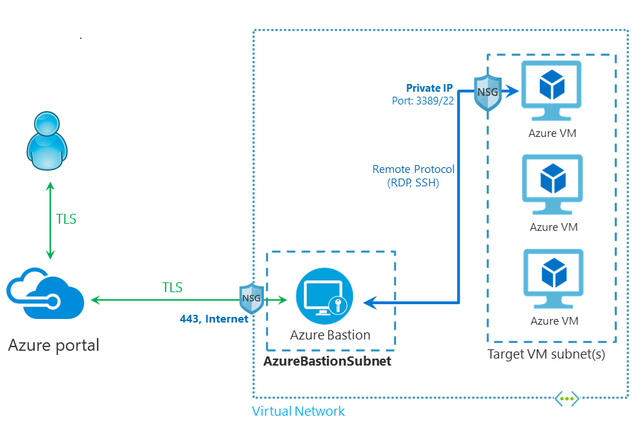

In previous episodes you may have witnessed me use a virtual machine in Azure. I always do that using [Azure Bastion](https://learn.microsoft.com/azure/bastion/bastion-overview), which gives you secure access to Linux and Windows virtual machines using SSH or RDP over HTTPS, without giving the VMs a public IP address or opening ports 22 or 3389 to the internet.

You can simply access your virtual machines by navigating to them in the Azure Portal, select connect | Bastion, enter credentials and you are in. Or you can use azcli!

Ok, so this is where I could have provided azcli commands to create a resource group, a virtual network with two subnets, a public ip address, a Bastion host, and a sample virtual machine. Instead I noticed a couple of things while creating a virtual network in the Azure Portal that convinced me to advise that approach:

* On the Security tab there is a checkbox to Enable Azure Bastion, which creates the Bastion and Public IP.
* On the IP addresses tab there is guidance on what ranges to use for the virtual network and subnets, which makes it easier to get right if you have less of an infrastructure background.

Now you can create a sample virtual machine to use through Bastion. With the vnet, bastion and public ip created, you don't need to create them for the VM: For public inbound ports select None, and for Public IP select None.

Note that for cost control I always enable auto-shutdown (22:00 local time) without notification.

You can even use azcli to connect your shell or VS Code to an Azure VM using bastion. Read [Jose's post](https://techcommunity.microsoft.com/t5/fasttrack-for-azure/accessing-aks-private-clusters-with-azure-bastion-and-vs-code/ba-p/3581367) for details.

Thanks for reading! :-)
