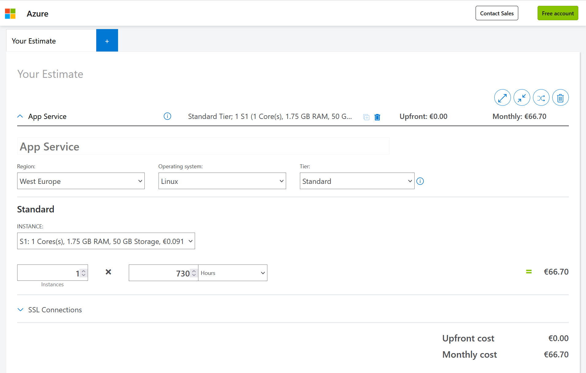
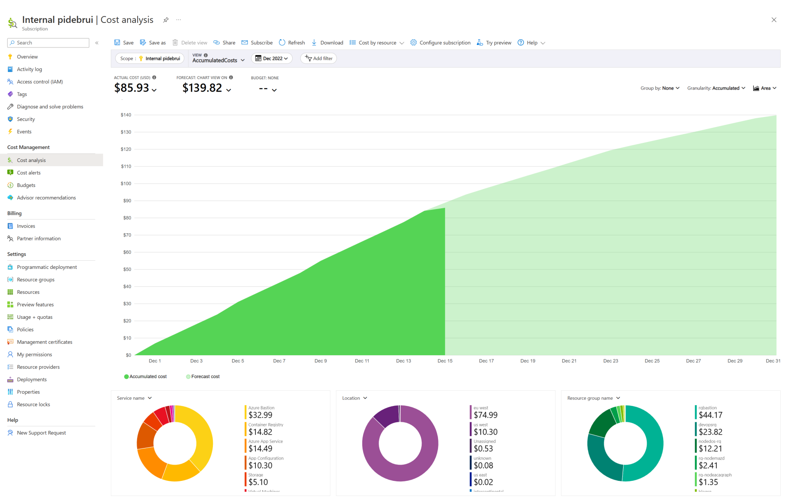

There is a new [cost optimization campaign](https://azure.microsoft.com/solutions/do-more-with-less/?wt.mc_id=pdebruin_content_blog_cnl_csasci), which reminded me I haven't blogged about cost management yet.

The cloud gives you both more possibilities as well as more responsibilities. For instance, I can deploy a website in Brazil, a function in South Africa and a Kubernetes cluster as big as my core quota allows in Australia, all within a couple of minutes of time, right from my home office in the Netherlands.

In the cloud you don't own physical assets but you do have to pay for what services you use. This is so important, that [cost optimization](https://learn.microsoft.com/azure/architecture/framework/cost/overview?wt.mc_id=pdebruin_content_blog_cnl_csasci) is part of the well-architected framework, since a solution can be functionally perfect, but if the cost are too high, it will not be a success.

Before you start deploying resources in Azure, you should work with the pricing calculator to understand the cost impact of your solution. If this is too complex, ask for help. You really want to know what your solution will cost in various environments before turning it on.

While you start deploying resource in Azure, you should become familiar Azure Cost management which helps with transparency. You can analyze what resources or resource groups cost for a day, a week, or any other period. And you can and should [set budgets and alerts](https://www.troyhunt.com/how-i-got-pwned-by-my-cloud-costs/) to get notified when spending crosses a certain threshold. During experimentation you will also learn about what resources are deployed and costs are incurred as a consequence to your actual deployment. For instance you will use some form of compute, and storage and cost, and depending on your workload they will cost. Next to this you may want to use resources that help performance or security of your solution and they will cost too.

Turn on what you want to use and turn off what you don't use. For instance, I often use a virtual machine in Azure to use its internet connection to pull container images, clone large repositories, etc during development. Those VMs have auto-shutdown enabled at 22:00 local time, so I don't pay for them at night in case I leave them running. Other services such as a website on App Service may always need to be online to respond to new visitors, but traffic may vary. This is where autoscaling can be useful, to only have the capacity running that you need, not all capacity needed for the busiest time.

Azure Advisor has a section on cost which may include recommendations like the above.

Lastly once you know what you are going to need and when you need it, you may want to think about reservations: In the cloud you pay per use and you pay a bit extra for unused capacity, where Azure has overcapacity stand-by in case a customer wants to start use it. Now if you know for sure that you will use at least a certain number of compute cores or storage bytes for the next year or three, you can purchase that reserved capacity at a lower cost.

An additional note about virtual machines: VMs have the biggest variety in types, series, sizes, etc, which can be intimidating at first. Then it really helps to use [VM chooser](https://azureprice.net/) to filter down to your required region, cores and memory and sort by price.

Watch a recent [Azure Friday episode about cost](https://www.youtube.com/watch?v=XQTQz-MgEBA)

Thanks for reading! :-)
