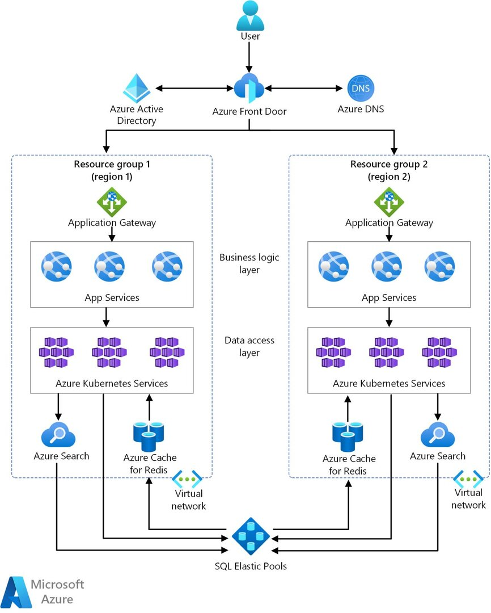

Posted to [linkedin](https://www.linkedin.com/posts/pieterjmdebruin_azure-architecture-center-activity-7011279913584312321-bPf9) first.

Me: "Write a blog post about [#azure #architecture #center](https://learn.microsoft.com/azure/architecture/)"

chat.openai.com:
"The Azure Architecture Center is a valuable resource for anyone looking to design, build, and maintain cloud-based solutions on Microsoft Azure. This comprehensive resource provides best practices, design patterns, and reference architectures for a wide range of scenarios, including data centers, hybrid cloud environments, and Internet of Things (IoT) solutions.

One of the key features of the Azure Architecture Center is its focus on the principles of cloud computing. These principles include scalability, reliability, security, and cost optimization, which are essential for building successful cloud-based solutions. The Azure Architecture Center provides guidance on how to implement these principles in your solutions, as well as examples of how they have been applied in real-world scenarios.

In addition to these principles, the Azure Architecture Center also covers a wide range of technical topics, including:
* #Data management: How to design and implement a data platform that meets the needs of your organization, including guidance on data storage, data processing, and data security.
* #Application #development: Best practices for building and deploying applications on Azure, including guidance on microservices, containers, and serverless computing.
* Networking: How to design and implement a network architecture that meets the needs of your organization, including guidance on virtual networking, load balancing, and security.
* #Identity and access management: How to design and implement an identity and access management solution that meets the needs of your organization, including guidance on authentication, authorization, and single sign-on.

The Azure Architecture Center also provides a wealth of resources for architects and developers looking to learn more about Azure and its capabilities. These resources include whitepapers, case studies, and technical guides that provide in-depth information on specific technologies and scenarios.

Overall, the Azure Architecture Center is an essential resource for anyone looking to build and maintain cloud-based solutions on Azure. Whether you're a seasoned cloud architect or just starting out, the Azure Architecture Center has something for everyone."

Thanks for reading! :-)
