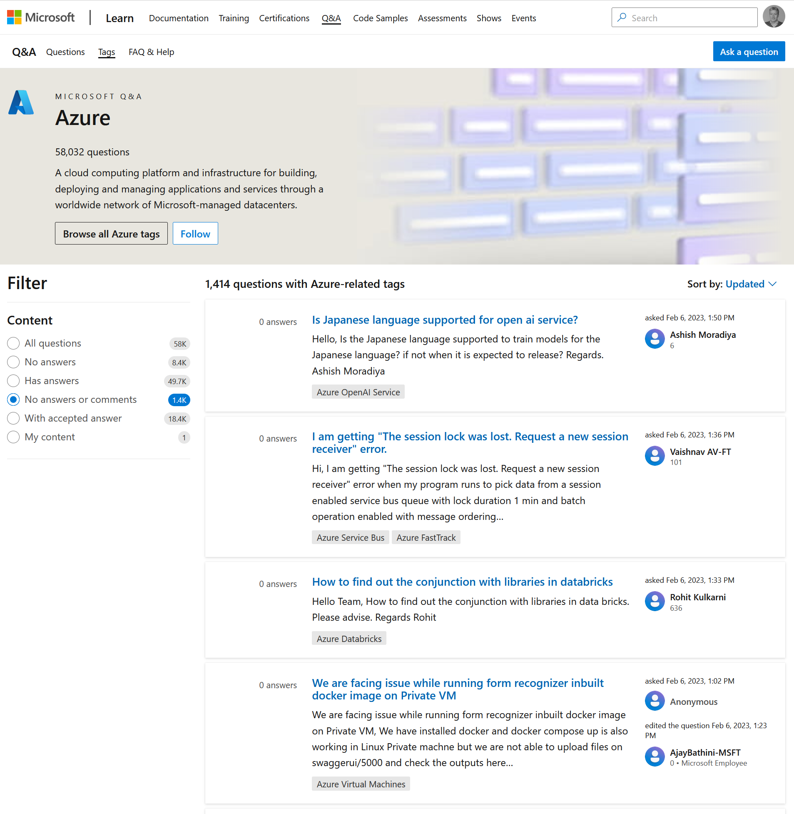

There are many things we don't know but others may: Sometimes you seach for answers, ask a colleague or a friend, or post on a forum. For that last option there is [Microsoft Q&A](https://learn.microsoft.com/answers/). You can find lots of Microsoft products and services there, and all kinds of people asking questions and answering them. Remember, you may be learning one technology and experienced in another.

Recently Microsoft Q&A was [updated](https://learn.microsoft.com/en-us/answers/support/release-notes?wt.mc_id=pdebruin_content_blog_cnl_csasci) and now includes light and dark themes, a new rich-text editor, etc. I love these kind of updates that gradually make the platform easier to use. Hope you do too.

Thanks for reading! :-)
