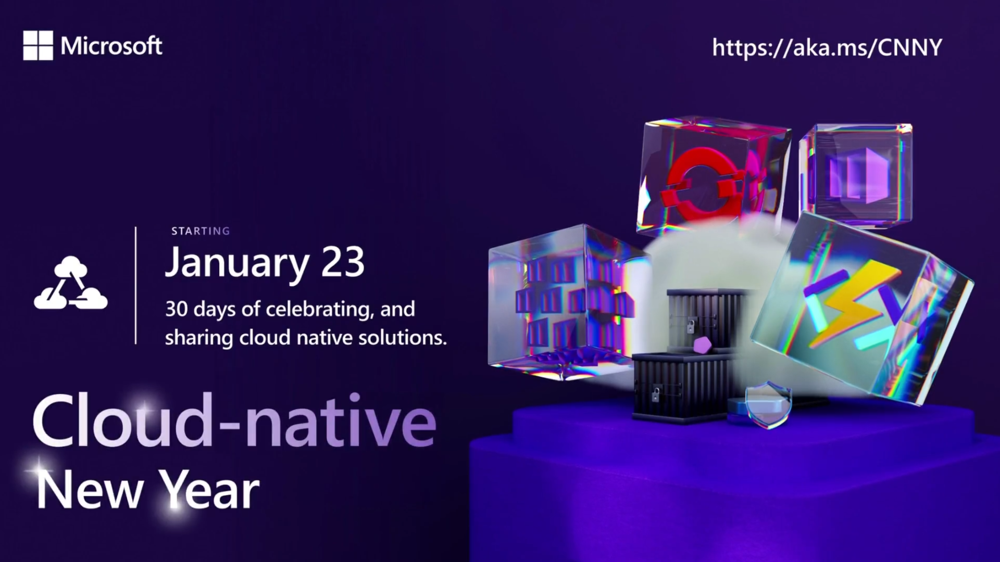

The cloud-native new year is a great way to learn about on Azure Kubernetes Service, Container Apps and Functions. If you are interested in that, head over to the [techcommunity post](https://techcommunity.microsoft.com/t5/microsoft-learn/join-us-for-cloud-native-new-year/m-p/3723530?wt.mc_id=pdebruin_content_blog_cnl_csasci).

The campaign consists of blog posts, ask the experts sessions and a [cloud skills challenge](https://learn.microsoft.com/users/cloudskillschallenge/collections/xkwnh4nzo5y6?wt.mc_id=pdebruin_content_blog_cnl_csasci). A challenge is a gamified way of sharing a collection. And a collection is just that: one or more links to Microsoft Learn content. Did you know you can create collections yourself? Let's take a look.

Any Learn page has a plus sign, which allows to add it to a new or existing collection. You can share those collections with your customers, partners, and audiences of blog of videos.

In your Learn profile there is a page with [your collections](https://learn.microsoft.com/users/me/collections?wt.mc_id=pdebruin_content_blog_cnl_csasci). 

Thanks for reading! :-)
