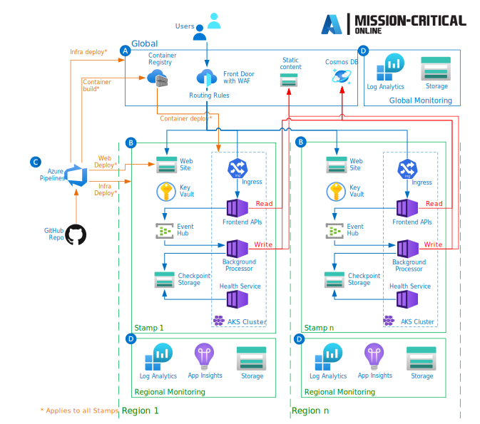

Recently I ran into an interesting project that deserves more attention: Mission critical online. And they made it to [Azure Friday](https://learn.microsoft.com/shows/azure-friday/continuously-validate-and-test-your-mission-critical-azure-workloads?wt.mc_id=pdebruin_content_blog_cnl_csasci), so it is not exactly a secret :-)

The episode was called [Continuous validation with Azure Load Testing and Azure Chaos Studio](https://learn.microsoft.com/azure/architecture/guide/testing/mission-critical-deployment-testing?wt.mc_id=pdebruin_content_blog_cnl_csasci), which is an interesting combination of two services I haven't used much. And they discussed how you decide what is [mission-critical](https://learn.microsoft.com/azure/architecture/framework/mission-critical/mission-critical-overview?wt.mc_id=pdebruin_content_blog_cnl_csasci) to you, as in you don't want it to go down.

The reference implementation uses Azure DevOps to load test Azure Front Door, the public front end, and to chaos test AKS, where the actual application runs.

[GitHub repo](https://github.com/Azure/Mission-Critical-Online)

Watch the Azure Friday episode first to understand you focus on the right things.

Thanks for reading! :-)
