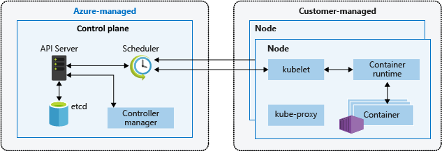

Draw, reuse, tell stories, contribute

Recently I became more involved in Azure architecture center, and I have noticed that diagrams get a lot of attention. Now let me be clear: a diagram is not the architecture of your solution. <insert good reference of an architecture including functional requirements, quality attributes, key scenarios, options and decisions> 

So, onto great diagrams. I am very interested to learn what you think. If you want to comment, find me on social media, or send me an email: pdebruin at hotmail dot com.

In preparation of this post I remembered a presentation called "Draw like an architect" by Brenda Carter. To me this is a good as starting point, since you may want to create in a formal file directly, or maybe you are more creative on a whiteboard, paper notebook, etc. Note that you likely want to publish and share in a file format, so make sure you are clear where the diagram is going. 

Then when you are starting, you may prefer a blank sheet. Or maybe you like to reuse an existing diagram, either because it is close to your envisioned solution, or because you like its format. Note that you can download diagrams from Azure architecture center to benefit. 

Just like reusing diagrams, you can reuse icons 
https://learn.microsoft.com/azure/architecture/icons/?wt.mc_id=pdebruin_content_blog_cnl_csasci

Creating cool, glowing architecture diagrams
https://www.youtube.com/watch?v=QR-64mFqhf4
Every diagram should tell a story

https://www.youtube.com/watch?v=_EKbbo9HPS4&t=161s

IASA?
Martin Fowler?

Dark vs light

Last week the [free tier](https://techcommunity.microsoft.com/t5/apps-on-azure-blog/azure-kubernetes-service-free-tier-and-standard-tier/ba-p/3731432?wt.mc_id=pdebruin_content_blog_cnl_csasci) for [Azure Kubernetes Service](https://learn.microsoft.com/azure/aks/intro-kubernetes?wt.mc_id=pdebruin_content_blog_cnl_csasci) was announced. Although it is correct, it also requires elaboration.

To read more about cost management, check out [this post](https://blog.pdebruin.org/cost-management/).

Thanks for reading! :-)
