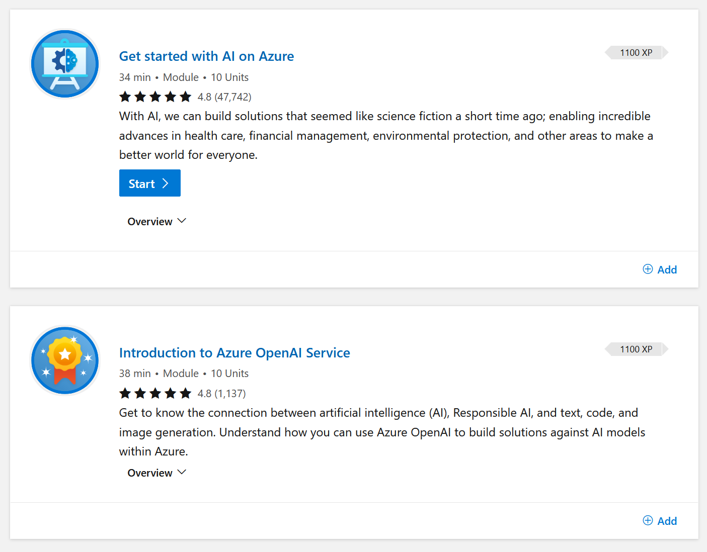

Previously data science and artificial intelligence were areas only accessible for people who had studied it during their master or phd. While some parts are still only understood by a few, the application of AI is becoming more accessible with platform services.

Artifical intelligence seems to have jumped in interest since the release of chatgpt (https://chat.openai.com). Many people and organizations are investigating what it is and what it could mean to them. Microsoft Learn has you covered, whether you want to understand [fundamentals of AI](https://learn.microsoft.com/en-us/training/paths/get-started-with-artificial-intelligence-on-azure/?wt.mc_id=pdebruin_content_blog_cnl_csasci), get a [certification](https://learn.microsoft.com/certifications/exams/ai-900?wt.mc_id=pdebruin_content_blog_cnl_csasci), or go hands-on with technologies like Azure OpenAI Service](https://learn.microsoft.com/azure/cognitive-services/openai/overview?wt.mc_id=pdebruin_content_blog_cnl_csasci). And this week [ChatGPT in Azure OpenAI Service](https://azure.microsoft.com/blog/chatgpt-is-now-available-in-azure-openai-service?wt.mc_id=pdebruin_content_blog_cnl_csasci) was announced.

That is a lot of information. Let's go over it one step at the time.

To start, let's take a look at ChatGPT by [OpenAI](https://openai.com). OpenAI is an AI research and development company with Microsoft [investments](https://blogs.microsoft.com/blog/2023/01/23/microsoftandopenaiextendpartnership/). ChatGPT became world famous very quickly when it was launched in November, and you saw [earlier](https://blog.pdebruin.org/azure-architecture-center/) that it can create impressive content. ChatGPT is built on top of OpenAI's Generative Pre-trained Transformer 3 (GPT-3), a language model the uses deep learning to produce human-like text. And what cool is, is that although the technological concepts are not new, exposing it in a chatbot makes it available to anyone. So now we can all become an AI user; you don't have to design logic and know all implementation details, you can just use it.

Although impressive, ChatGPT is "just" one application. All search engines are joining the hype, and actually all content businesses are also getting interested. What does this mean for schools, for research, for journalism, etc? Please note that whatever bots like ChatGPT and underlying models say, they don't have to be true or real, so common sense is still allowed.

Suppose ChatGPT made you curious to what artificial intelligence is, how do you get started? That is where you can look at the links above that lead to training paths, certification prep, and product documentation. You should also note that Azure has had cognitive services for years that cover vision, language, speech and decision areas, which are APIs that you can use in applications today without PHD required.

Thanks for reading! :-)
