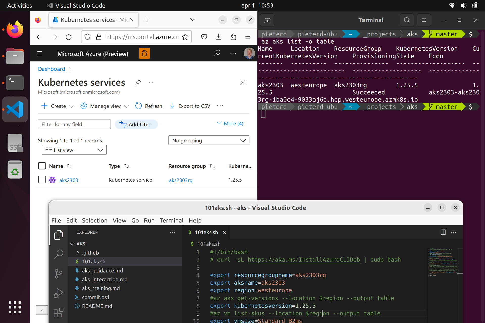

Recently I received a new work laptop, a Surface Laptop Studio and previously a Surface Book. Obviously Surface devices run Windows by default. And I also want to use Linux every now and then, for instance when doing demos for Linux audiences or creating or reviewing technical documentation.  

There are a few ways to work with Linux on a Surface device. First is [Windows Subsystem for Linux](./accessing-azure-terminal/). Next is a Linux virtual machine in Azure [using Bastion](./bastion-ssh-rdp/), especially when it needs more compute, storage or networking than a Surface device. And lastly there is dual boot, the option to run Linux on Surface directly, while keeping the option to switch to Windows when needed. This post describes the latter.

The first thing to know is that you can [install Ubuntu](https://ubuntu.com/tutorials/install-ubuntu-desktop) on your laptop or desktop. In Windows disk management you create a new partition, and follow the tutorial.

Once you have done that, you will recognize some device components or not recognized or not working as expected. This is where the [linux-surface](https://github.com/linux-surface/linux-surface/wiki/Supported-Devices-and-Features#feature-matrix) repo comes in. They have documented all Surface devices and their features. And then there is also a wiki with [known issues](https://github.com/linux-surface/linux-surface/wiki/Surface-Laptop-Studio). Ok, so it looks like some components may get to work and others may not. Let's try. 

And as described I had to edit a file manually to get the touchpad to work. 

git
code

pretty prompt

az cli

Thanks for reading! :-)
