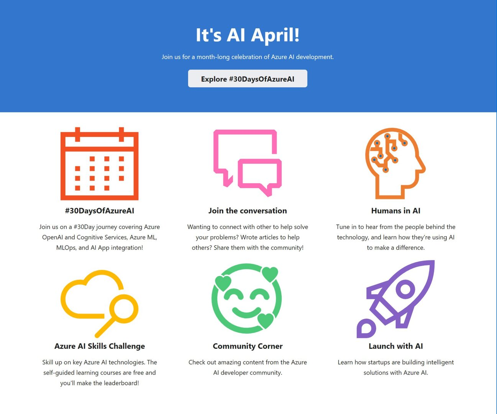

It's AI April!

There is so much news around artificial intelligence 🧠, generative pre-trained transformers 💬 and co-pilots 🧑🏽‍✈️. This is the time for developers to learn all about it in the #30DaysOfAzureAI, running now through April

[Join #30DaysOfAzureAI](https://azureaidevs.github.io/hub/azure-ai-devs?wt.mc_id=pdebruin_content_blog_cnl_csasci)

Thanks for reading! :-)
