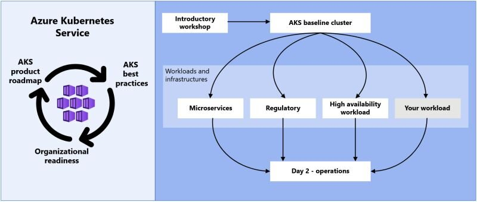

When you want to learn more about running Kubernetes on Azure, Microsoft Learn has you covered from training, reference implementations to operations best practices.

[Containers in Azure architecture center](https://learn.microsoft.com/en-us/azure/architecture/reference-architectures/containers/aks-start-here?wt.mc_id=pdebruin_content_blog_cnl_csasci)

Thanks for reading! :-)
