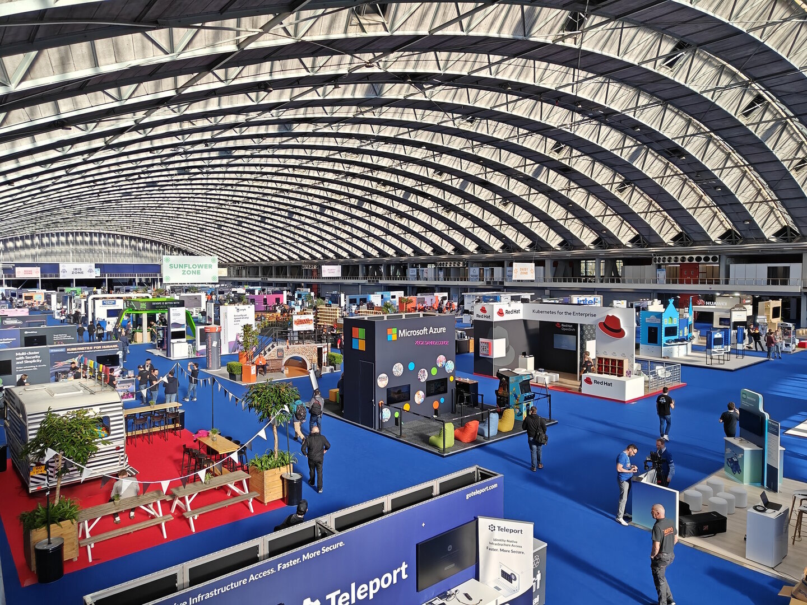

Last week I attended KubeCon. Nowadays I don't have much opportunity to travel to conferences, so when one of the biggest events shows up about 30 kilometers from your home, you really want to be there.

When I worked at Docker I attended lots of events and met a lot of people from the open-source community, partners, and customers. This kubecon was a reunion after covid and it was great seeing many again. 

Most of the time I worked at the booth to make connections in person. There I had all kinds of conversations from people who are new to Kubernetes and Azure Kubernetes Service, to concrete user scenarios and feedback from veterans.

[Watch recorded presentations](https://www.youtube.com/@cncf/videos)

[Join a project](https://contribute.cncf.io/contributors/)

[Start to learn](https://learn.microsoft.com/en-us/training/paths/intro-to-kubernetes-on-azure/?wt.mc_id=pdebruin_content_blog_cnl_csasci)

Thanks for reading! :-)
