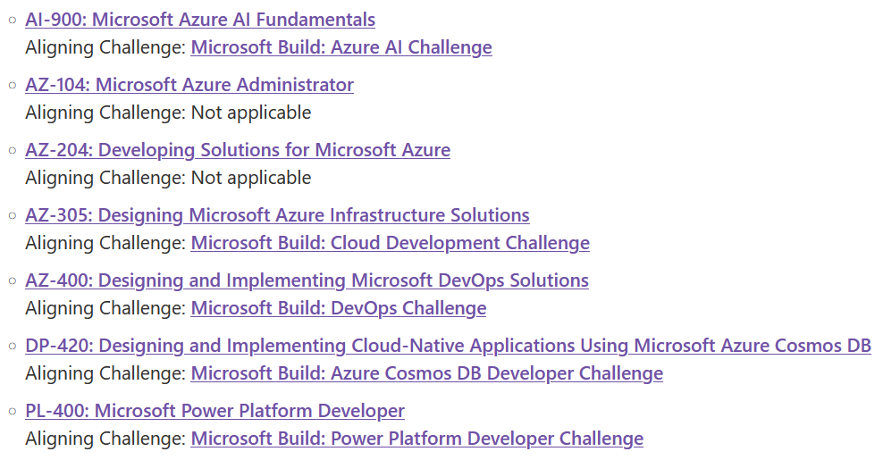

Microsoft Build is happening on May 23-24. Both Build and Ignite are big events at Microsoft; many product groups prepare to have something interesting to present.

This year there is likely going to be some information around artificial intelligence. Next to that I personally love to hear from personalities like [Satya Nadella](https://build.microsoft.com/speakers/c201dad3-b585-4a2e-bf56-ec317db3591e?source=sessions&wt.mc_id=architecture_contributors_blog_cnl), [Scott Guthrie](https://build.microsoft.com/speakers/c05d9baf-0923-4206-98a9-ece9713ad3ac?source=sessions&wt.mc_id=architecture_contributors_blog_cnl), [Scott Hanselman](https://build.microsoft.com/speakers/0cfc3644-3749-4d44-abeb-29ca7dfc89d0?source=sessions&wt.mc_id=architecture_contributors_blog_cnl), [Mark Russinovich](https://build.microsoft.com/speakers/6f0478b1-c207-4779-9dd5-862d90d40308?source=sessions&wt.mc_id=architecture_contributors_blog_cnl), and many others.

You can register [here](https://build.microsoft.com?wt.mc_id=architecture_contributors_blog_cnl).

That is all great, but what is in it for me? Well, good that you ask :-) There are [cloud skills challenges](https://www.microsoft.com/cloudskillschallenge/build/registration/2023?), that help you learn about a specific area. And during the month after build you can get a free exam voucher for completing them. Note that you can only get one exam voucher. And if you are interested to do a specific exam, you should do the corresponding challenge, see below. 

Thanks for reading! :-)
