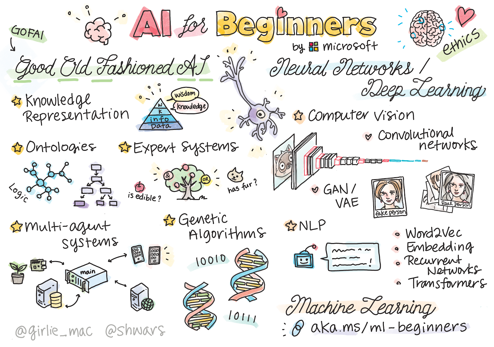

Democratizing knowledge the pragmatic way:
Did you know about [Microsoft repos for beginners](https://github.com/orgs/microsoft/repositories?q=beginners&type=all&language=&sort=)?

Specifically, with the buzz around artificial intelligence, I think it is great that you can start at the beginning.

[AI for beginners](https://github.com/microsoft/ai-for-beginners)

[Data science for beginners](https://github.com/microsoft/Data-Science-For-Beginners)

[Generative AI for beginners](https://github.com/microsoft/generative-ai-for-beginners)

[Machine Learning for beginners](https://github.com/microsoft/ML-For-Beginners)

Try them for your self. See what suits your learning needs. 

Thanks for reading! :-)
