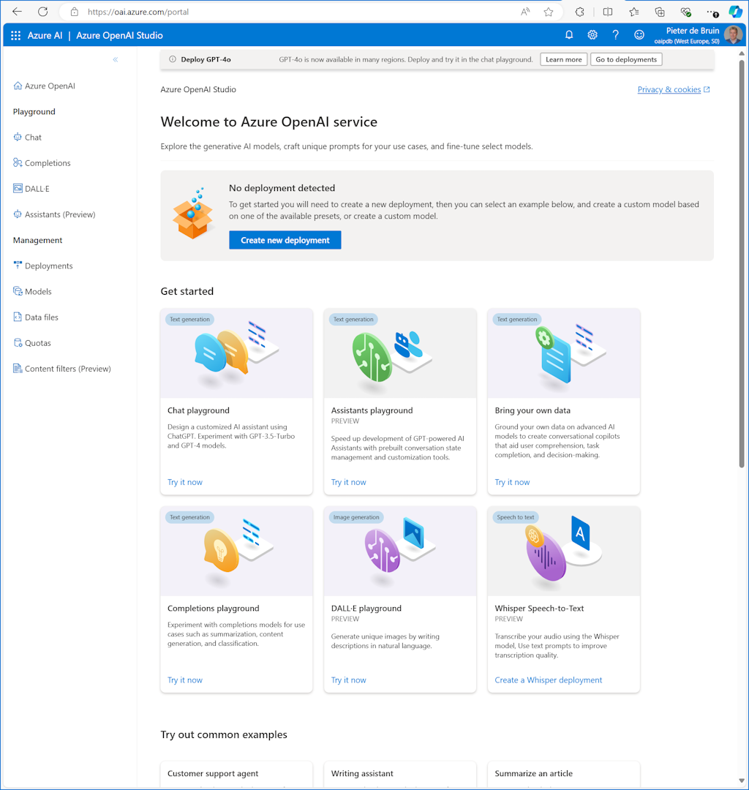

By now, you have heard about chatgpt, and probably also tried it yourself. Maybe you had it create a paragraph of text for a blog post, or create an image of your dreams :-) So have I, and then there is the serious note: AI requires a lot of hardware and resources to perform all these actions. Then the question is, can it improve our lives, our work, and other things we care about? 

The first thing you should know, is that chatgpt is a public service, which means that its data is also public. This is fine if you ask it a generic question that you would normally look up through an internet search. But what if you want it to ask it about information within your organization? You don't want to upload a confidential document to chatgpt to have it summarized or turned into a presentation, because then you have shared it publicly and others will find a way to get access too. That is where Azure OpenAI service can help, which you deploy in your own cloud environment with identity and network controls applied. 

Once you have Azure OpenAI deployed, you can build your customer genai solution. The following blog post shares a couple ideas of how we see businesses transform with the help of genai. 

[Blog post](https://azure.microsoft.com/blog/azure-openai-service-10-ways-generative-ai-is-transforming-businesses/)?

Thanks for reading! :-)
