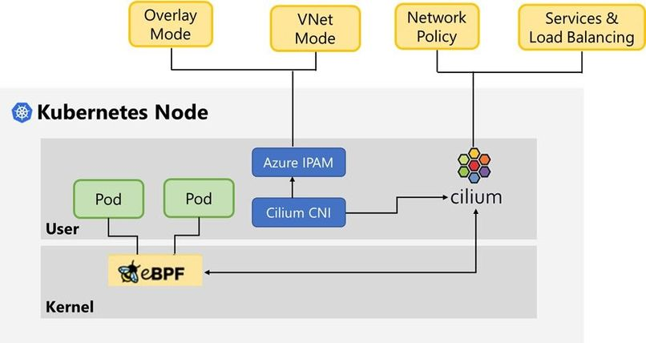

As a devops engineer, I don't want to worry about compute, storage, and networking :-) I learned this the hard way at a calico training in a previous life. 

Long story short: When you are creating a containerized app with no explicit network requirements, you use kubenet by default. If you did have specific networking requirements, the Azure container networking interface (CNI) could be an option, which is a bit more complex in terms of planning and design. And now with Cilium for CNI, which is eBPF-based, there is an even more advanced option for high performance and low latency. Note that this has some prerequisites and limitations, like linux only, so make sure you have an expert to help with this. 

[Availability blog post](https://azure.microsoft.com/blog/azure-cni-with-cilium-most-scalable-and-performant-container-networking-in-the-cloud/)?

[Preview post](https://techcommunity.microsoft.com/t5/azure-networking-blog/azure-cni-powered-by-cilium-for-azure-kubernetes-service-aks/ba-p/3662341)

Thanks for reading! :-)
