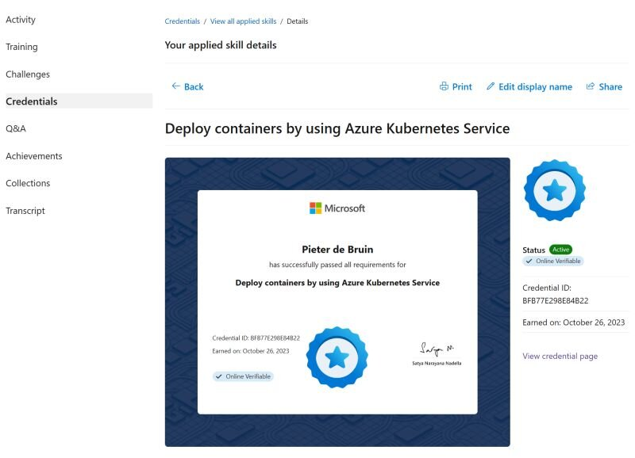

I just earned a new Applied Skill credential on Microsoft Learn 🎉, and so can you 😍 (A 2-hour hands-on test in an interactive Azure lab environment) Read more: [Announcing Microsoft Applied Skills, the new credentials to verify in-demand technical skills](https://techcommunity.microsoft.com/t5/microsoft-learn-blog/announcing-microsoft-applied-skills-the-new-credentials-to/ba-p/3775645). 👀 

Thanks for reading! :-)
