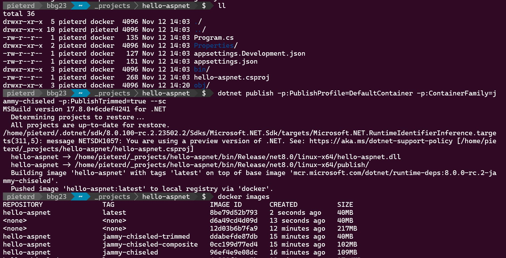

Excited about [dotnetconf](https://www.dotnetconf.net/) this week? How about this: ASPNET runs on Linux and containers (for 7+ years). By default 217MB 🤔 using Ubuntu for compatibility. Want smaller? Learn about chisel and trim! Now you are at 40MB! 😍 You bet I am excited! Hat tip to Rich Lander and [his container workshop](https://github.com/richlander/container-workshop)

```
dotnet publish -p:PublishProfile=DefaultContainer
-p:ContainerFamily=jammy-chiseled -p:PublishTrimmed=true --sc
```



[Announcement](https://devblogs.microsoft.com/dotnet/announcing-dotnet-chiseled-containers/)

Thanks for reading! :-)
