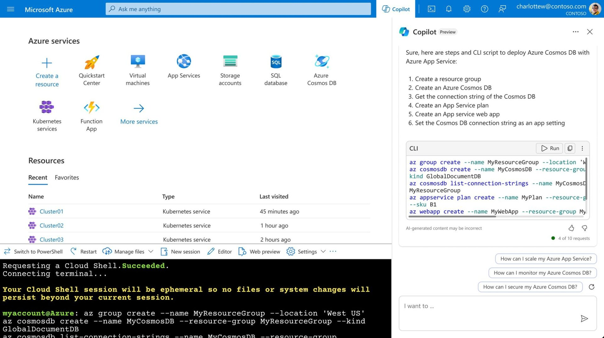

Hi copilot, can you please show me the steps and cli commands to host a nosql database and webapp in Azure? 😍

[Announcement](https://techcommunity.microsoft.com/t5/azure-infrastructure-blog/simplify-it-management-with-microsoft-copilot-for-azure-save/ba-p/3981106)

Thanks for reading! :-)
