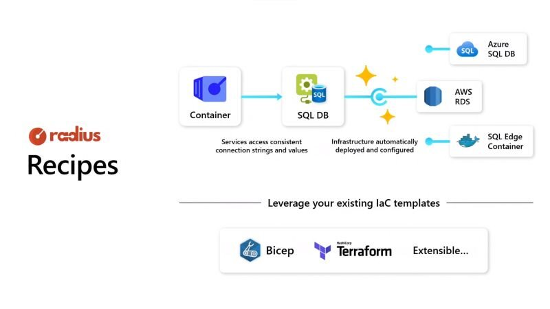

Radius is a new project from the Azure incubations team. It helps devs and ops engineers to collaborate by defining an app's cloud-native infrastructure as code in Kubernetes and/or cloud platform services.

[Blog announcement](https://cloudblogs.microsoft.com/opensource/2023/10/18/enabling-developer-collaboration-with-radius/?wt.mc_id=pdebruin_content_blog_cnl_csasci)

[Open at Microsoft video](https://learn.microsoft.com/shows/open-at-microsoft/introducing-radius-a-new-open-source-project-for-teams-building-cloud-native-apps?wt.mc_id=pdebruin_content_blog_cnl_csasci)

[Ignite presentation](https://ignite.microsoft.com/en-US/sessions/6550e671-ec19-4801-a8b4-0644853cd339?wt.mc_id=pdebruin_content_blog_cnl_csasci)

[Radius project](https://radapp.io)

Thanks for reading! :-)

