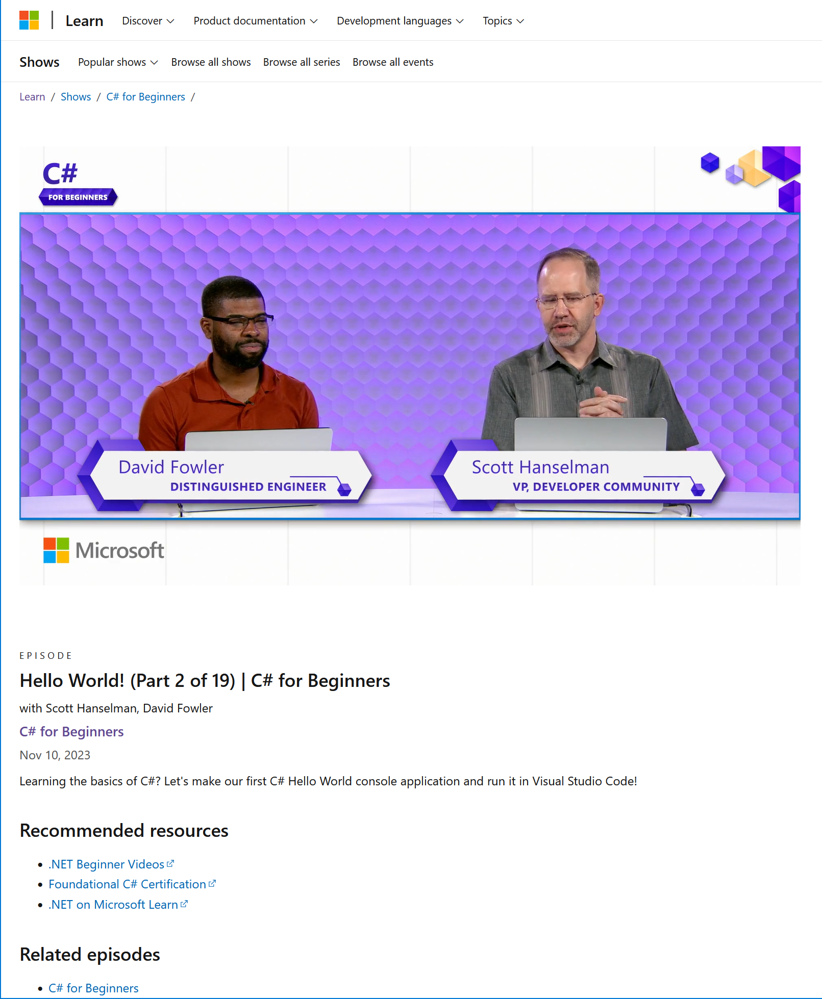

Interested in learning c# (or how to create dev videos)? Watch the [c# for beginners series](https://learn.microsoft.com/shows/csharp-for-beginners/?wt.mc_id=pdebruin_content_blog_cnl_csasci). 

Thanks for reading! :-)

