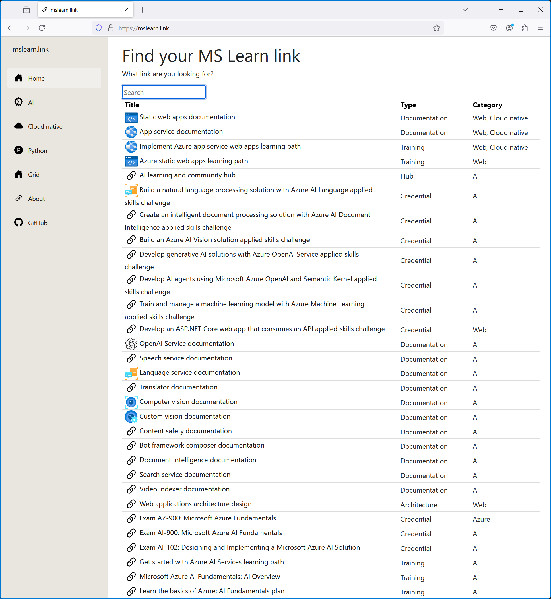

In January 2022 I moved from Microsoft Netherlands to Microsoft Corp to work on Microsoft Learn. At the time our team started to run various programs to grow contributors and contributions to Learn content, initially mostly documentation. After various reorganizations, I work on slightly different things, but still for Microsoft Learn. I like the domain, since it allows me to work with technology and experiment with free knowledge sharing and thought leadership. 

Sometimes I also see things that can be improved :-) which I then mostly discuss internally. In this case I was unhappy with the experience for Microsoft Learn users, who can land on a number of different pages that eventually all point to the same documentation, trainings, etc. As a result, I wanted to experiment with providing a flat list of unique entry points to Learn content that is searchable and that takes away all marketing and landing pages. 

The result is [mslearn.link](https://mslearn.link).

Let me know what you think. Good? Bad? Don't care? Other? 

Thanks for reading! :-)

