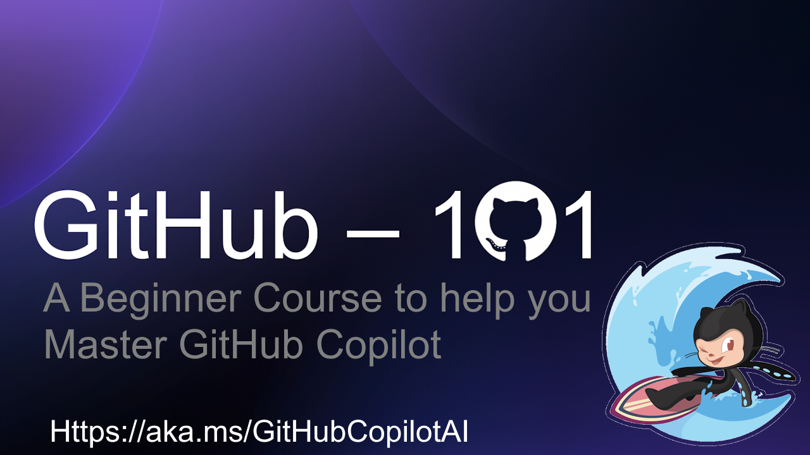

Unlock the power of collaborative coding with our comprehensive curriculum on Mastering GitHub Copilot for Paired Programming. This cutting-edge program seamlessly integrates AI-driven coding assistance through GitHub Copilot, empowering students to accelerate their coding skills in tandem with a partner. Over the course of 10 engaging hours, participants will navigate through essential setup procedures, leveraging Visual Studio Code and GitHub Copilot Chat for real-time collaboration. Dive deep into GitHub Copilot's autocompletion, customizable features, and advanced programming techniques, all while embracing AI-driven algorithms. From error handling to unit testing, this curriculum is tailored to instill best practices and enhance code quality. Immerse yourself in a transformative learning experience that fuses the latest AI technology with paired programming strategies, equipping you with the tools needed for success in today's dynamic software development landscape.

[Repository](https://github.com/microsoft/Mastering-GitHub-Copilot-for-Paired-Programming)

Thanks for reading! :-)
