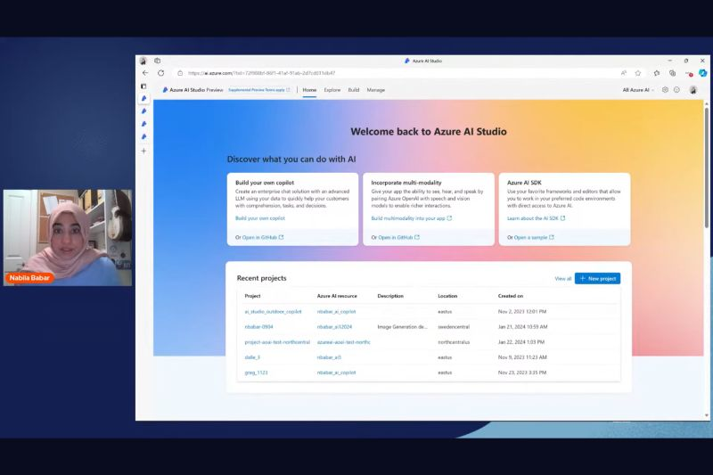

Dive into Azure AI Studio to learn how your customers can build generative AI applications such as an enterprise chat copilot. We'll share how to use prebuilt and customizable models from Azure OpenAI Service, leverage the playground for Retrieval Augmentation Generation, streamline the development cycle with prompt flow, evaluate model responses and AI apps for quality and safety, and scale Proof of Concepts (PoCs) for use in websites, applications, and other production environments. Join us for a journey of innovation!

[Video](https://www.youtube.com/watch?v=--wUqOeAzWU)

[Documentation](https://learn.microsoft.com/azure/ai-studio/what-is-ai-studio?wt.mc_id=pdebruin_content_blog_cnl_csasci)

[Learning path](https://learn.microsoft.com/en-gb/training/paths/create-custom-copilots-ai-studio/?wt.mc_id=pdebruin_content_blog_cnl_csasci)

Thanks for reading! :-)
