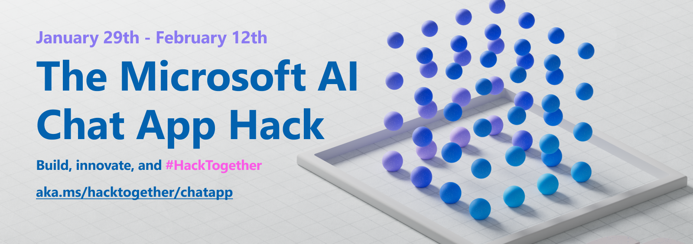

Build, innovate and hack together!

While the hackaton is time bound, the material is available before and after. 

GPT models are powerful language generators, but they don't know everything about the world. Retrieval Augmented Generation (RAG) combines the power of GPT with the knowledge of a search engine. This allows you to ask questions of your own data, and get answers that are relevant to the context of your question. We'll show you how to build a RAG Chat App using Azure OpenAI, Azure AI Search, and Python, and extend it for your own data sources. 🎉

https://github.com/microsoft/AI-Chat-App-Hack

Thanks for reading! :-)
