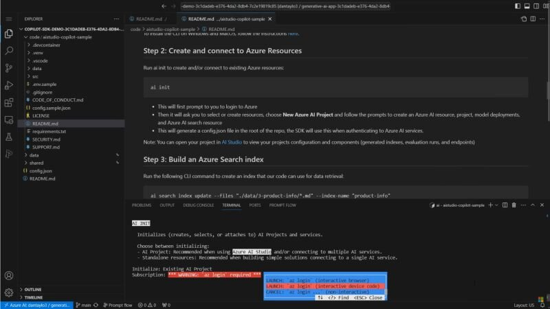

I just used Azure AI CLI, a cross-platform tool in preview that can connect your application to Azure AI services and perform operations without having to write any code. 

[A code-first experience for building a copilot with Azure AI](https://techcommunity.microsoft.com/t5/ai-ai-platform-blog/a-code-first-experience-for-building-a-copilot-with-azure-ai/ba-p/4058659?wt.mc_id=pdebruin_content_blog_cnl_csasci)

Thanks for reading! :-)
