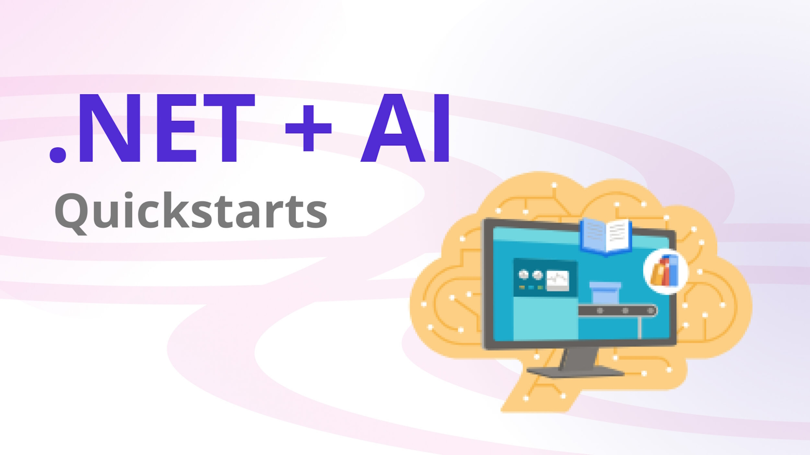

If you’ve been thinking of infusing your existing .NET apps with generative AI & Large Language Models (LLMs), now is a great time to dive in and we have new quickstarts to help you out. We’ve just released a new set of quickstarts that you can use with large language models from OpenAI.

[Source](https://devblogs.microsoft.com/dotnet/get-started-with-dotnet-ai-quickstarts/?wt.mc_id=pdebruin_content_blog_cnl_csasci)

Thanks for reading! :-)
