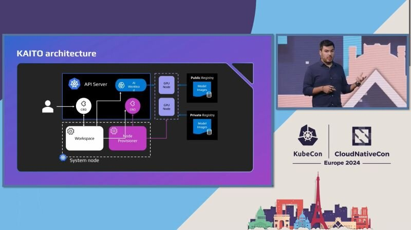

Are you using Kubernetes and wondering how to add AI to it? 🤔 Take a look at Kubernetes AI Toolchain Operator (KAITO) to deploy an AI model to AKS 🎉

⚙️ Repository https://lnkd.in/ebCX_BDB
📺 Video https://lnkd.in/eaAHTQ5n
📃 Documentation https://lnkd.in/ewqGnBT4

Thanks for reading! :-)
