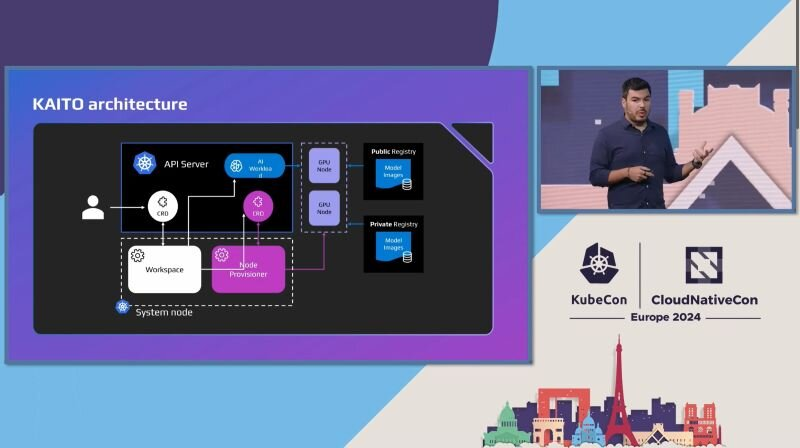

Are you using Kubernetes and wondering how to add AI to it? 🤔 Take a look at Kubernetes AI Toolchain Operator (KAITO) to deploy an AI model to AKS 🎉

⚙️ [Repository](https://github.com/Azure/kaito)

📺 [Video](https://www.youtube.com/watch?v=r7qd0ZHt4uE)

📃 [Documentation](https://learn.microsoft.com/azure/aks/ai-toolchain-operator?wt.mc_id=pdebruin_content_blog_cnl_csasci)

Thanks for reading! :-)
