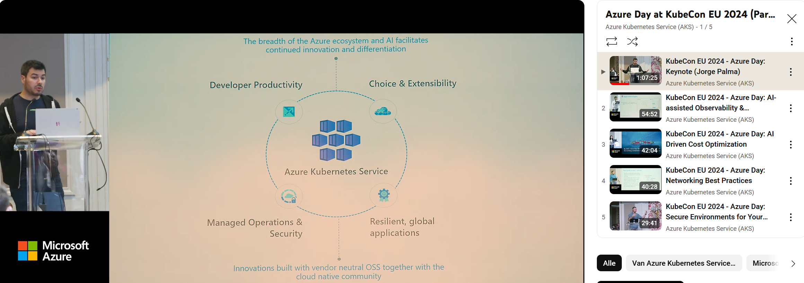

[KubeCon EU](https://events.linuxfoundation.org/kubecon-cloudnativecon-europe/) happened in Paris from March 19 to 22. Before the main event, Microsoft organized a preday about Azure. The recorded presentations from that day are available to watch at your convenience. 

[Videos](https://www.youtube.com/watch?v=5DvWfSIs4-s&list=PLc3Ep462vVYtskqK9JUWltwA1wdbD8hjq)

Thanks for reading! :-)
