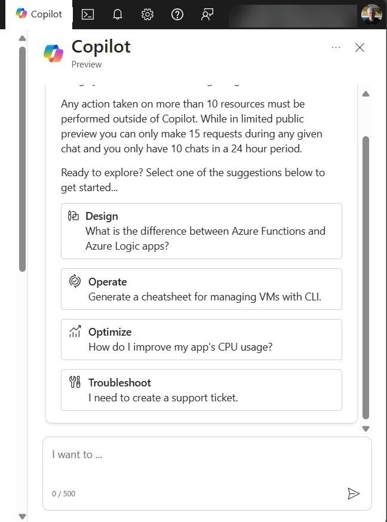

Earlier I shared my excitement about [Azure copilot](../azure-portal-copilot).

Now you can read about the background of how we built the Microsoft Learn knowledge service that powers the Azure copilot. 

[Source](https://devblogs.microsoft.com/engineering-at-microsoft/how-we-built-ask-learn-the-rag-based-knowledge-service/?wt.mc_id=pdebruin_content_blog_cnl_csasci)

Thanks for reading! :-)
